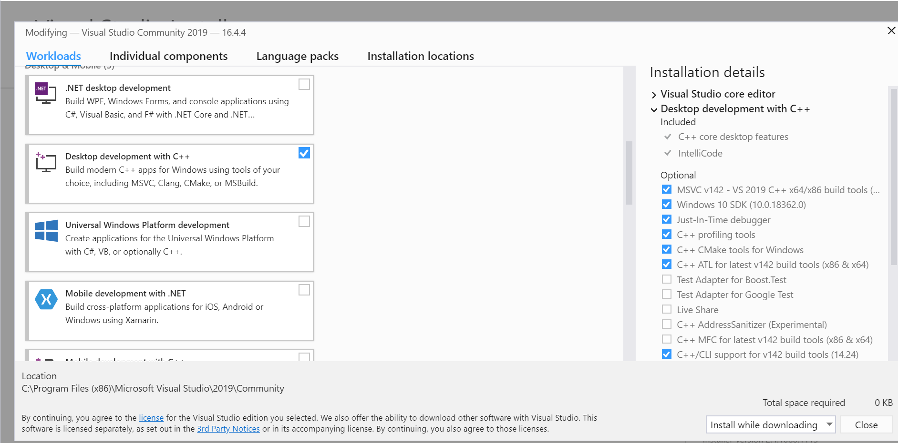
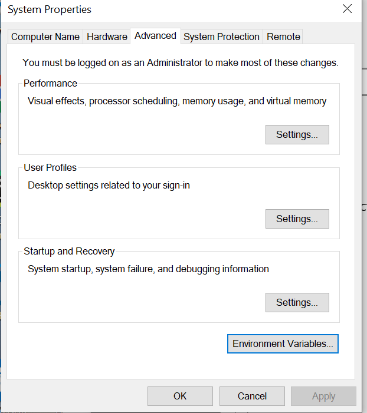
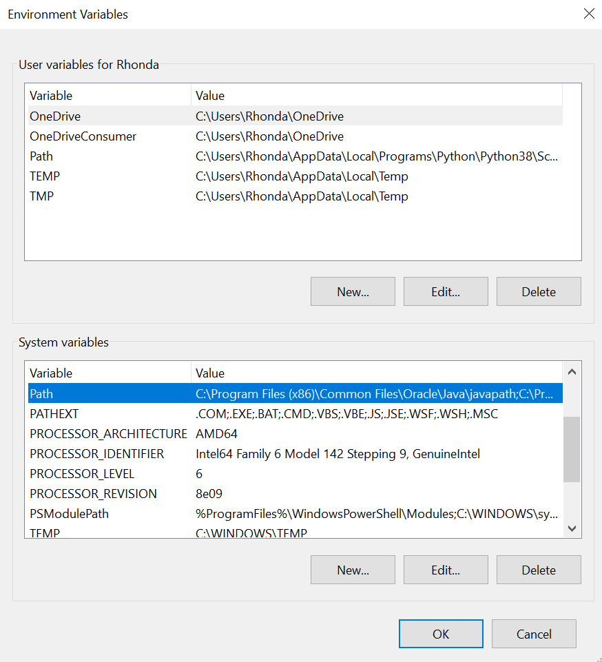

# 15 steps outlined to install cloudmesh-installer and multipass in Windows 10 Pro environment
## First step: install Visual C++
* Used Microsoft Visual Studio Community version installer plus the Build Tools
 for Visual Studio on the same download site lower down under "Tools for
  Visual Studio 2019"
<https://visualstudio.microsof.com/downloads/> (installed the blue checks
 visible
 in the next print screen)

* Update path to cl.exe in "Advanced System Settings" **Environment Variables**

* Add to environment variable: path


* directory added to path
 
 C:\Program Files (x86)\Microsoft Visual Studio\2019
\Community\VC
\Tools\MSVC\14.24.28314\bin\Hostx64\x64\
## For steps 2-15 see detail in next section (line numbers in bullets from Pycharm editor)
2. Ensure up-to-date versions of python and pip [line numbers: 40 -50]
3. Install python in ENV3 environment [51]
4. Activate ENV3 [53]
5. Ensure ENV3 has up-to-date versions of pip (error message updating pip can
 be ignored because version does get updated)
6. Install cloudmesh-installer [80 -]
7. Ensure cloudmesh-installer is up-to-date [116 - ]
8. In cm directory, use cloudmesh-installer to clone cms from github [134 -]
9. Install cms [162 -]
10. Use cms commands: help, banner, debug, set list [338-418]
11. Use cloudmesh-installer to clone cloudmesh-windows in cm directory
 [420
-644]
12. Run cms windows check [659 - 712]
13. Use cloudmesh-installer to clone multipass in cm dir [713-755]
14. Install multipass (fill up your coffee and watch for errors; the two times
 manual errors show is known and not a problem) [760 - 1425 ]
15. Run cms multipass images [1531]

## Screen capture text
C:\Users\Rhonda>color f0

C:\Users\Rhonda>python --version
Python 3.8.1

C:\Users\Rhonda>pip --version

pip 20.0.2 from c:\users\rhonda\appdata\local\programs\python\python38\lib\site-packages\pip (python 3.8)

C:\Users\Rhonda>where python
C:\Users\Rhonda\AppData\Local\Programs\Python\Python38\python.exe
C:\Users\Rhonda\AppData\Local\Microsoft\WindowsApps\python.exe

C:\Users\Rhonda>python -m venv ENV3

C:\Users\Rhonda>ENV3\Scripts\activate

(ENV3) C:\Users\Rhonda>where python
C:\Users\Rhonda\ENV3\Scripts\python.exe
C:\Users\Rhonda\AppData\Local\Programs\Python\Python38\python.exe
C:\Users\Rhonda\AppData\Local\Microsoft\WindowsApps\python.exe

(ENV3) C:\Users\Rhonda>python --version
Python 3.8.1

(ENV3) C:\Users\Rhonda>pip --version
pip 19.2.3 from c:\users\rhonda\env3\lib\site-packages\pip (python 3.8)

(ENV3) C:\Users\Rhonda>pip install pip -U
Collecting pip
  Using cached https://files.pythonhosted.org/packages/54/0c/d01aa759fdc501a58f431eb594a17495f15b88da142ce14b5845662c13f3/pip-20.0.2-py2.py3-none-any.whl
Installing collected packages: pip
  Found existing installation: pip 19.2.3
    Uninstalling pip-19.2.3:
      Successfully uninstalled pip-19.2.3
ERROR: Could not install packages due to an EnvironmentError: [WinError 5] Access is denied: 'C:\\Users\\Rhonda\\AppData\\Local\\Temp\\pip-uninstall-g8zdanuh\\pip.exe'
Consider using the `--user` option or check the permissions.


(ENV3) C:\Users\Rhonda>pip --version
pip 20.0.2 from c:\users\rhonda\env3\lib\site-packages\pip (python 3.8)

(ENV3) C:\Users\Rhonda>pip install cloudmesh-installer
Collecting cloudmesh-installer
  Using cached cloudmesh_installer-4.3.11-py2.py3-none-any.whl (13 kB)
Collecting humanize
  Downloading humanize-1.0.0-py2.py3-none-any.whl (51 kB)
     |████████████████████████████████| 51 kB 118 kB/s
Collecting python-hostlist
  Using cached python-hostlist-1.20.tar.gz (35 kB)
Collecting docopt
  Using cached docopt-0.6.2.tar.gz (25 kB)
Collecting psutil
  Using cached psutil-5.6.7-cp38-cp38-win_amd64.whl (236 kB)
Collecting colorama
  Using cached colorama-0.4.3-py2.py3-none-any.whl (15 kB)
Collecting tabulate
  Using cached tabulate-0.8.6.tar.gz (45 kB)
Collecting requests
  Using cached requests-2.22.0-py2.py3-none-any.whl (57 kB)
Collecting oyaml
  Using cached oyaml-0.9-py2.py3-none-any.whl (3.0 kB)
Collecting urllib3!=1.25.0,!=1.25.1,<1.26,>=1.21.1
  Using cached urllib3-1.25.8-py2.py3-none-any.whl (125 kB)
Collecting certifi>=2017.4.17
  Using cached certifi-2019.11.28-py2.py3-none-any.whl (156 kB)
Collecting chardet<3.1.0,>=3.0.2
  Using cached chardet-3.0.4-py2.py3-none-any.whl (133 kB)
Collecting idna<2.9,>=2.5
  Using cached idna-2.8-py2.py3-none-any.whl (58 kB)
Collecting pyyaml
  Using cached PyYAML-5.3-cp38-cp38-win_amd64.whl (218 kB)
Installing collected packages: humanize, python-hostlist, docopt, psutil, colorama, tabulate, urllib3, certifi, chardet, idna, requests, pyyaml, oyaml, cloudmesh-installer
    Running setup.py install for python-hostlist ... done
    Running setup.py install for docopt ... done
    Running setup.py install for tabulate ... done
Successfully installed certifi-2019.11.28 chardet-3.0.4 cloudmesh-installer-4.3.11 colorama-0.4.3 docopt-0.6.2 humanize-1.0.0 idna-2.8 oyaml-0.9 psutil-5.6.7 python-hostlist-1.20 pyyaml-5.3 requests-2.22.0 tabulate-0.8.6 urllib3-1.25.8

(ENV3) C:\Users\Rhonda>pip install cloudmesh-installer -U
Requirement already up-to-date: cloudmesh-installer in c:\users\rhonda\env3\lib\site-packages (4.3.11)
Requirement already satisfied, skipping upgrade: requests in c:\users\rhonda\env3\lib\site-packages (from cloudmesh-installer) (2.22.0)
Requirement already satisfied, skipping upgrade: oyaml in c:\users\rhonda\env3\lib\site-packages (from cloudmesh-installer) (0.9)
Requirement already satisfied, skipping upgrade: humanize in c:\users\rhonda\env3\lib\site-packages (from cloudmesh-installer) (1.0.0)
Requirement already satisfied, skipping upgrade: tabulate in c:\users\rhonda\env3\lib\site-packages (from cloudmesh-installer) (0.8.6)
Requirement already satisfied, skipping upgrade: python-hostlist in c:\users\rhonda\env3\lib\site-packages (from cloudmesh-installer) (1.20)
Requirement already satisfied, skipping upgrade: colorama in c:\users\rhonda\env3\lib\site-packages (from cloudmesh-installer) (0.4.3)
Requirement already satisfied, skipping upgrade: psutil in c:\users\rhonda\env3\lib\site-packages (from cloudmesh-installer) (5.6.7)
Requirement already satisfied, skipping upgrade: docopt in c:\users\rhonda\env3\lib\site-packages (from cloudmesh-installer) (0.6.2)
Requirement already satisfied, skipping upgrade: idna<2.9,>=2.5 in c:\users\rhonda\env3\lib\site-packages (from requests->cloudmesh-installer) (2.8)
Requirement already satisfied, skipping upgrade: chardet<3.1.0,>=3.0.2 in c:\users\rhonda\env3\lib\site-packages (from requests->cloudmesh-installer) (3.0.4)
Requirement already satisfied, skipping upgrade: certifi>=2017.4.17 in c:\users\rhonda\env3\lib\site-packages (from requests->cloudmesh-installer) (2019.11.28)
Requirement already satisfied, skipping upgrade: urllib3!=1.25.0,!=1.25.1,<1.26,>=1.21.1 in c:\users\rhonda\env3\lib\site-packages (from requests->cloudmesh-installer) (1.25.8)
Requirement already satisfied, skipping upgrade: pyyaml in c:\users\rhonda\env3\lib\site-packages (from oyaml->cloudmesh-installer) (5.3)

(ENV3) C:\Users\Rhonda>cd cm

(ENV3) C:\Users\Rhonda\cm>cloudmesh-installer git clone cms
clone -> cloudmesh-common
cloudmesh-common
git clone https://github.com/cloudmesh/cloudmesh-common.git
         Cloning into 'cloudmesh-common'...

clone -> cloudmesh-cmd5
cloudmesh-cmd5
git clone https://github.com/cloudmesh/cloudmesh-cmd5.git
         Cloning into 'cloudmesh-cmd5'...

clone -> cloudmesh-sys
cloudmesh-sys
git clone https://github.com/cloudmesh/cloudmesh-sys.git
         Cloning into 'cloudmesh-sys'...

clone -> cloudmesh-configuration
cloudmesh-configuration
git clone https://github.com/cloudmesh/cloudmesh-configuration.git
         Cloning into 'cloudmesh-configuration'...

clone -> cloudmesh-manual
cloudmesh-manual
git clone https://github.com/cloudmesh/cloudmesh-manual.git
         Cloning into 'cloudmesh-manual'...
Checking out files: 100% (1217/1217), done.


(ENV3) C:\Users\Rhonda\cm>cloudmesh-installer install cms

######################################################################
# Installing bundle cms
######################################################################
cloudmesh-common
cloudmesh-cmd5
cloudmesh-sys
cloudmesh-configuration
cloudmesh-manual

install -> cloudmesh-common
Obtaining file:///C:/Users/Rhonda/cm/cloudmesh-common
Collecting pytz
  Using cached pytz-2019.3-py2.py3-none-any.whl (509 kB)
Requirement already satisfied: python-hostlist in c:\users\rhonda\env3\lib\site-packages (from cloudmesh-common==4.2.30) (1.20)
Collecting simplejson
  Using cached simplejson-3.17.0.tar.gz (83 kB)
Requirement already satisfied: oyaml in c:\users\rhonda\env3\lib\site-packages (from cloudmesh-common==4.2.30) (0.9)
Requirement already satisfied: colorama in c:\users\rhonda\env3\lib\site-packages (from cloudmesh-common==4.2.30) (0.4.3)
Requirement already satisfied: psutil in c:\users\rhonda\env3\lib\site-packages (from cloudmesh-common==4.2.30) (5.6.7)
Collecting pathlib
  Using cached pathlib-1.0.1.tar.gz (49 kB)
Requirement already satisfied: humanize in c:\users\rhonda\env3\lib\site-packages (from cloudmesh-common==4.2.30) (1.0.0)
Collecting python-dateutil
  Using cached python_dateutil-2.8.1-py2.py3-none-any.whl (227 kB)
Requirement already satisfied: pyyaml in c:\users\rhonda\env3\lib\site-packages (from oyaml->cloudmesh-common==4.2.30) (5.3)
Collecting six>=1.5
  Using cached six-1.14.0-py2.py3-none-any.whl (10 kB)
Installing collected packages: pytz, simplejson, pathlib, six, python-dateutil, cloudmesh-common
    Running setup.py install for simplejson ... done
    Running setup.py install for pathlib ... done
  Running setup.py develop for cloudmesh-common
Successfully installed cloudmesh-common pathlib-1.0.1 python-dateutil-2.8.1 pytz-2019.3 simplejson-3.17.0 six-1.14.0
install -> cloudmesh-cmd5
Obtaining file:///C:/Users/Rhonda/cm/cloudmesh-cmd5
Requirement already satisfied: pyyaml in c:\users\rhonda\env3\lib\site-packages (from cloudmesh-cmd5==4.2.14) (5.3)
Requirement already satisfied: docopt in c:\users\rhonda\env3\lib\site-packages (from cloudmesh-cmd5==4.2.14) (0.6.2)
Requirement already satisfied: requests in c:\users\rhonda\env3\lib\site-packages (from cloudmesh-cmd5==4.2.14) (2.22.0)
Requirement already satisfied: cloudmesh-common in c:\users\rhonda\cm\cloudmesh-common (from cloudmesh-cmd5==4.2.14) (4.2.30)
Requirement already satisfied: urllib3!=1.25.0,!=1.25.1,<1.26,>=1.21.1 in c:\users\rhonda\env3\lib\site-packages (from requests->cloudmesh-cmd5==4.2.14) (1.25.8)
Requirement already satisfied: chardet<3.1.0,>=3.0.2 in c:\users\rhonda\env3\lib\site-packages (from requests->cloudmesh-cmd5==4.2.14) (3.0.4)
Requirement already satisfied: idna<2.9,>=2.5 in c:\users\rhonda\env3\lib\site-packages (from requests->cloudmesh-cmd5==4.2.14) (2.8)
Requirement already satisfied: certifi>=2017.4.17 in c:\users\rhonda\env3\lib\site-packages (from requests->cloudmesh-cmd5==4.2.14) (2019.11.28)
Requirement already satisfied: pytz in c:\users\rhonda\env3\lib\site-packages (from cloudmesh-common->cloudmesh-cmd5==4.2.14) (2019.3)
Requirement already satisfied: python-hostlist in c:\users\rhonda\env3\lib\site-packages (from cloudmesh-common->cloudmesh-cmd5==4.2.14) (1.20)
Requirement already satisfied: simplejson in c:\users\rhonda\env3\lib\site-packages (from cloudmesh-common->cloudmesh-cmd5==4.2.14) (3.17.0)
Requirement already satisfied: oyaml in c:\users\rhonda\env3\lib\site-packages (from cloudmesh-common->cloudmesh-cmd5==4.2.14) (0.9)
Requirement already satisfied: colorama in c:\users\rhonda\env3\lib\site-packages (from cloudmesh-common->cloudmesh-cmd5==4.2.14) (0.4.3)
Requirement already satisfied: psutil in c:\users\rhonda\env3\lib\site-packages (from cloudmesh-common->cloudmesh-cmd5==4.2.14) (5.6.7)
Requirement already satisfied: pathlib in c:\users\rhonda\env3\lib\site-packages (from cloudmesh-common->cloudmesh-cmd5==4.2.14) (1.0.1)
Requirement already satisfied: humanize in c:\users\rhonda\env3\lib\site-packages (from cloudmesh-common->cloudmesh-cmd5==4.2.14) (1.0.0)
Requirement already satisfied: python-dateutil in c:\users\rhonda\env3\lib\site-packages (from cloudmesh-common->cloudmesh-cmd5==4.2.14) (2.8.1)
Requirement already satisfied: six>=1.5 in c:\users\rhonda\env3\lib\site-packages (from python-dateutil->cloudmesh-common->cloudmesh-cmd5==4.2.14) (1.14.0)
Installing collected packages: cloudmesh-cmd5
  Running setup.py develop for cloudmesh-cmd5
Successfully installed cloudmesh-cmd5
install -> cloudmesh-sys
Obtaining file:///C:/Users/Rhonda/cm/cloudmesh-sys
Collecting wheel
  Downloading wheel-0.34.2-py2.py3-none-any.whl (26 kB)
Collecting twine
  Using cached twine-3.1.1-py3-none-any.whl (36 kB)
Requirement already satisfied: cloudmesh-common in c:\users\rhonda\cm\cloudmesh-common (from cloudmesh-sys==4.1.4) (4.2.30)
Requirement already satisfied: cloudmesh-cmd5 in c:\users\rhonda\cm\cloudmesh-cmd5 (from cloudmesh-sys==4.1.4) (4.2.14)
Collecting pkginfo>=1.4.2
  Using cached pkginfo-1.5.0.1-py2.py3-none-any.whl (25 kB)
Collecting tqdm>=4.14
  Downloading tqdm-4.42.1-py2.py3-none-any.whl (59 kB)
     |████████████████████████████████| 59 kB 1.2 MB/s
Collecting keyring>=15.1
  Using cached keyring-21.1.0-py2.py3-none-any.whl (31 kB)
Collecting readme-renderer>=21.0
  Using cached readme_renderer-24.0-py2.py3-none-any.whl (15 kB)
Requirement already satisfied: requests>=2.20 in c:\users\rhonda\env3\lib\site-packages (from twine->cloudmesh-sys==4.1.4) (2.22.0)
Collecting requests-toolbelt!=0.9.0,>=0.8.0
  Using cached requests_toolbelt-0.9.1-py2.py3-none-any.whl (54 kB)
Requirement already satisfied: setuptools>=0.7.0 in c:\users\rhonda\env3\lib\site-packages (from twine->cloudmesh-sys==4.1.4) (41.2.0)
Requirement already satisfied: pytz in c:\users\rhonda\env3\lib\site-packages (from cloudmesh-common->cloudmesh-sys==4.1.4) (2019.3)
Requirement already satisfied: python-hostlist in c:\users\rhonda\env3\lib\site-packages (from cloudmesh-common->cloudmesh-sys==4.1.4) (1.20)
Requirement already satisfied: simplejson in c:\users\rhonda\env3\lib\site-packages (from cloudmesh-common->cloudmesh-sys==4.1.4) (3.17.0)
Requirement already satisfied: oyaml in c:\users\rhonda\env3\lib\site-packages (from cloudmesh-common->cloudmesh-sys==4.1.4) (0.9)
Requirement already satisfied: colorama in c:\users\rhonda\env3\lib\site-packages (from cloudmesh-common->cloudmesh-sys==4.1.4) (0.4.3)
Requirement already satisfied: psutil in c:\users\rhonda\env3\lib\site-packages (from cloudmesh-common->cloudmesh-sys==4.1.4) (5.6.7)
Requirement already satisfied: pathlib in c:\users\rhonda\env3\lib\site-packages (from cloudmesh-common->cloudmesh-sys==4.1.4) (1.0.1)
Requirement already satisfied: humanize in c:\users\rhonda\env3\lib\site-packages (from cloudmesh-common->cloudmesh-sys==4.1.4) (1.0.0)
Requirement already satisfied: python-dateutil in c:\users\rhonda\env3\lib\site-packages (from cloudmesh-common->cloudmesh-sys==4.1.4) (2.8.1)
Requirement already satisfied: pyyaml in c:\users\rhonda\env3\lib\site-packages (from cloudmesh-cmd5->cloudmesh-sys==4.1.4) (5.3)
Requirement already satisfied: docopt in c:\users\rhonda\env3\lib\site-packages (from cloudmesh-cmd5->cloudmesh-sys==4.1.4) (0.6.2)
Collecting pywin32-ctypes!=0.1.0,!=0.1.1; sys_platform == "win32"
  Using cached pywin32_ctypes-0.2.0-py2.py3-none-any.whl (28 kB)
Collecting bleach>=2.1.0
  Using cached bleach-3.1.0-py2.py3-none-any.whl (157 kB)
Requirement already satisfied: six in c:\users\rhonda\env3\lib\site-packages (from readme-renderer>=21.0->twine->cloudmesh-sys==4.1.4) (1.14.0)
Collecting docutils>=0.13.1
  Using cached docutils-0.16-py2.py3-none-any.whl (548 kB)
Collecting Pygments
  Using cached Pygments-2.5.2-py2.py3-none-any.whl (896 kB)
Requirement already satisfied: certifi>=2017.4.17 in c:\users\rhonda\env3\lib\site-packages (from requests>=2.20->twine->cloudmesh-sys==4.1.4) (2019.11.28)
Requirement already satisfied: urllib3!=1.25.0,!=1.25.1,<1.26,>=1.21.1 in c:\users\rhonda\env3\lib\site-packages (from requests>=2.20->twine->cloudmesh-sys==4.1.4) (1.25.8)
Requirement already satisfied: idna<2.9,>=2.5 in c:\users\rhonda\env3\lib\site-packages (from requests>=2.20->twine->cloudmesh-sys==4.1.4) (2.8)
Requirement already satisfied: chardet<3.1.0,>=3.0.2 in c:\users\rhonda\env3\lib\site-packages (from requests>=2.20->twine->cloudmesh-sys==4.1.4) (3.0.4)
Collecting webencodings
  Using cached webencodings-0.5.1-py2.py3-none-any.whl (11 kB)
Installing collected packages: wheel, pkginfo, tqdm, pywin32-ctypes, keyring, webencodings, bleach, docutils, Pygments, readme-renderer, requests-toolbelt, twine, cloudmesh-sys
  Running setup.py develop for cloudmesh-sys
Successfully installed Pygments-2.5.2 bleach-3.1.0 cloudmesh-sys docutils-0.16 keyring-21.1.0 pkginfo-1.5.0.1 pywin32-ctypes-0.2.0 readme-renderer-24.0 requests-toolbelt-0.9.1 tqdm-4.42.1 twine-3.1.1 webencodings-0.5.1 wheel-0.34.2
install -> cloudmesh-configuration
Obtaining file:///C:/Users/Rhonda/cm/cloudmesh-configuration
Requirement already satisfied: pathlib in c:\users\rhonda\env3\lib\site-packages (from cloudmesh-configuration==4.2.2) (1.0.1)
Collecting munch
  Using cached munch-2.5.0-py2.py3-none-any.whl (10 kB)
Requirement already satisfied: requests in c:\users\rhonda\env3\lib\site-packages (from cloudmesh-configuration==4.2.2) (2.22.0)
Requirement already satisfied: oyaml in c:\users\rhonda\env3\lib\site-packages (from cloudmesh-configuration==4.2.2) (0.9)
Collecting cryptography
  Using cached cryptography-2.8-cp38-cp38-win_amd64.whl (1.5 MB)
Requirement already satisfied: six in c:\users\rhonda\env3\lib\site-packages (from munch->cloudmesh-configuration==4.2.2) (1.14.0)
Requirement already satisfied: chardet<3.1.0,>=3.0.2 in c:\users\rhonda\env3\lib\site-packages (from requests->cloudmesh-configuration==4.2.2) (3.0.4)
Requirement already satisfied: idna<2.9,>=2.5 in c:\users\rhonda\env3\lib\site-packages (from requests->cloudmesh-configuration==4.2.2) (2.8)
Requirement already satisfied: certifi>=2017.4.17 in c:\users\rhonda\env3\lib\site-packages (from requests->cloudmesh-configuration==4.2.2) (2019.11.28)
Requirement already satisfied: urllib3!=1.25.0,!=1.25.1,<1.26,>=1.21.1 in c:\users\rhonda\env3\lib\site-packages (from requests->cloudmesh-configuration==4.2.2) (1.25.8)
Requirement already satisfied: pyyaml in c:\users\rhonda\env3\lib\site-packages (from oyaml->cloudmesh-configuration==4.2.2) (5.3)
Collecting cffi!=1.11.3,>=1.8
  Downloading cffi-1.14.0-cp38-cp38-win_amd64.whl (177 kB)
     |████████████████████████████████| 177 kB 1.1 MB/s
Processing c:\users\rhonda\appdata\local\pip\cache\wheels\6d\fb\fb\c752da1378a60304d18004cc5c58e73519a798ee2809db7562\pycparser-2.19-py2.py3-none-any.whl
Installing collected packages: munch, pycparser, cffi, cryptography, cloudmesh-configuration
  Running setup.py develop for cloudmesh-configuration
Successfully installed cffi-1.14.0 cloudmesh-configuration cryptography-2.8 munch-2.5.0 pycparser-2.19
install -> cloudmesh-manual
Obtaining file:///C:/Users/Rhonda/cm/cloudmesh-manual
Requirement already satisfied: Pygments in c:\users\rhonda\env3\lib\site-packages (from cloudmesh-manual==4.2.0) (2.5.2)
Collecting sphinx_rtd_theme
  Using cached sphinx_rtd_theme-0.4.3-py2.py3-none-any.whl (6.4 MB)
Collecting recommonmark
  Using cached recommonmark-0.6.0-py2.py3-none-any.whl (10 kB)
Requirement already satisfied: cloudmesh-common in c:\users\rhonda\cm\cloudmesh-common (from cloudmesh-manual==4.2.0) (4.2.30)
Requirement already satisfied: cloudmesh-cmd5 in c:\users\rhonda\cm\cloudmesh-cmd5 (from cloudmesh-manual==4.2.0) (4.2.14)
Requirement already satisfied: cloudmesh-sys in c:\users\rhonda\cm\cloudmesh-sys (from cloudmesh-manual==4.2.0) (4.1.4)
ERROR: Could not find a version that satisfies the requirement cloudmesh-storage (from cloudmesh-manual==4.2.0) (from versions: none)
ERROR: No matching distribution found for cloudmesh-storage (from cloudmesh-manual==4.2.0)


######################################################################
# Platform
######################################################################
{'cpu_count': 4,
 'mac_version': '',
 'machine': ('AMD64',),
 'mem_available': '3.0 GiB',
 'mem_free': '3.0 GiB',
 'mem_percent': '61.2%',
 'mem_total': '7.7 GiB',
 'mem_used': '4.7 GiB',
 'node': ('DESKTOP-6IAQLPE',),
 'platform': 'Windows-10-10.0.18362-SP0',
 'processor': ('Intel64 Family 6 Model 142 Stepping 9, GenuineIntel',),
 'processors': 'Windows',
 'python': '3.8.1 (tags/v3.8.1:1b293b6, Dec 18 2019, 23:11:46) [MSC v.1916 64 '
           'bit (AMD64)]',
 'release': ('10',),
 'sys': 'win32',
 'system': 'Windows',
 'user': '',
 'version': '10.0.18362',
 'win_version': ('10', '10.0.18362', 'SP0', '')}

######################################################################
# Timers
######################################################################
install cloudmesh-common 27.48
install cloudmesh-cmd5 2.46
install cloudmesh-sys 26.45
install cloudmesh-configuration 9.33
install cloudmesh-manual 3.0

(ENV3) C:\Users\Rhonda\cm>cms help

Documented commands (type help <topic>):
========================================
EOF     commands  echo  man     py    set    stopwatch  version
banner  debug     help  pause   q     shell  sys
clear   default   info  plugin  quit  sleep  var


(ENV3) C:\Users\Rhonda\cm>cms banner hello
banner
######################################################################
# hello
######################################################################

(ENV3) C:\Users\Rhonda\cm>cms clear
'clear' is not recognized as an internal or external command,
operable program or batch file.

(ENV3) C:\Users\Rhonda\cm>cms debug

Usage:

    debug on
    debug off


Description:

    debug on

        sets the variables

        debug=True
        trace=True
        verbose=10
        timer=True

    debug off

        sets the variables

        debug=False
        trace=False
        verbose=0
        timer=False


ERROR: Could not execute the command. Please check usage with

    cms help debug


(ENV3) C:\Users\Rhonda\cm>cms debug on
Timer: 0.0000s (debug on)

(ENV3) C:\Users\Rhonda\cm>cms banner hello
banner
######################################################################
# hello
######################################################################
Timer: 0.0000s (banner hello)

(ENV3) C:\Users\Rhonda\cm>cms set list
timer='True'
debug='True'
trace='True'
verbose='10'
Timer: 0.0000s (set list)

(ENV3) C:\Users\Rhonda\cm>cms debug off

(ENV3) C:\Users\Rhonda\cm>cms set list
timer='False'
debug='False'
trace='False'
verbose='0'

(ENV3) C:\Users\Rhonda\cm>cms debug on
Timer: 0.0000s (debug on)

(ENV3) C:\Users\Rhonda\cm>cloudmesh-installer git clone windows
clone -> cloudmesh-common
         ERROR: not downloaded as repo already exists.
clone -> cloudmesh-cmd5
         ERROR: not downloaded as repo already exists.
clone -> cloudmesh-sys
         ERROR: not downloaded as repo already exists.
clone -> cloudmesh-configuration
         ERROR: not downloaded as repo already exists.
clone -> cloudmesh-manual
         ERROR: not downloaded as repo already exists.
clone -> cloudmesh-windows
cloudmesh-windows
git clone https://github.com/cloudmesh/cloudmesh-windows.git
         Cloning into 'cloudmesh-windows'...


(ENV3) C:\Users\Rhonda\cm>dir
 Volume in drive C is OS
 Volume Serial Number is B4FE-D40E

 Directory of C:\Users\Rhonda\cm

02/08/2020  04:52 PM    <DIR>          .
02/08/2020  04:52 PM    <DIR>          ..
02/08/2020  04:36 PM    <DIR>          .idea
02/03/2020  09:52 PM    <DIR>          cloudbook
02/08/2020  04:44 PM    <DIR>          cloudmesh-cmd5
02/08/2020  04:43 PM    <DIR>          cloudmesh-common
02/08/2020  04:44 PM    <DIR>          cloudmesh-configuration
02/08/2020  04:45 PM    <DIR>          cloudmesh-manual
02/08/2020  04:44 PM    <DIR>          cloudmesh-sys
02/08/2020  04:52 PM    <DIR>          cloudmesh-windows
02/08/2020  04:06 PM    <DIR>          sp20-516-246
               0 File(s)              0 bytes
              11 Dir(s)  12,569,051,136 bytes free
              
(ENV3) C:\Users\Rhonda\cm>cloudmesh-installer install windows

######################################################################
# Installing bundle windows
######################################################################
cloudmesh-common
cloudmesh-cmd5
cloudmesh-sys
cloudmesh-configuration
cloudmesh-manual
cloudmesh-windows

install -> cloudmesh-common
Obtaining file:///C:/Users/Rhonda/cm/cloudmesh-common
Requirement already satisfied: pytz in c:\users\rhonda\env3\lib\site-packages (from cloudmesh-common==4.2.30) (2019.3)
Requirement already satisfied: python-hostlist in c:\users\rhonda\env3\lib\site-packages (from cloudmesh-common==4.2.30) (1.20)
Requirement already satisfied: simplejson in c:\users\rhonda\env3\lib\site-packages (from cloudmesh-common==4.2.30) (3.17.0)
Requirement already satisfied: oyaml in c:\users\rhonda\env3\lib\site-packages (from cloudmesh-common==4.2.30) (0.9)
Requirement already satisfied: colorama in c:\users\rhonda\env3\lib\site-packages (from cloudmesh-common==4.2.30) (0.4.3)
Requirement already satisfied: psutil in c:\users\rhonda\env3\lib\site-packages (from cloudmesh-common==4.2.30) (5.6.7)
Requirement already satisfied: pathlib in c:\users\rhonda\env3\lib\site-packages (from cloudmesh-common==4.2.30) (1.0.1)
Requirement already satisfied: humanize in c:\users\rhonda\env3\lib\site-packages (from cloudmesh-common==4.2.30) (1.0.0)
Requirement already satisfied: python-dateutil in c:\users\rhonda\env3\lib\site-packages (from cloudmesh-common==4.2.30) (2.8.1)
Requirement already satisfied: pyyaml in c:\users\rhonda\env3\lib\site-packages (from oyaml->cloudmesh-common==4.2.30) (5.3)
Requirement already satisfied: six>=1.5 in c:\users\rhonda\env3\lib\site-packages (from python-dateutil->cloudmesh-common==4.2.30) (1.14.0)
Installing collected packages: cloudmesh-common
  Attempting uninstall: cloudmesh-common
    Found existing installation: cloudmesh-common 4.2.30
    Uninstalling cloudmesh-common-4.2.30:
      Successfully uninstalled cloudmesh-common-4.2.30
  Running setup.py develop for cloudmesh-common
Successfully installed cloudmesh-common
install -> cloudmesh-cmd5
Obtaining file:///C:/Users/Rhonda/cm/cloudmesh-cmd5
Requirement already satisfied: pyyaml in c:\users\rhonda\env3\lib\site-packages (from cloudmesh-cmd5==4.2.14) (5.3)
Requirement already satisfied: docopt in c:\users\rhonda\env3\lib\site-packages (from cloudmesh-cmd5==4.2.14) (0.6.2)
Requirement already satisfied: requests in c:\users\rhonda\env3\lib\site-packages (from cloudmesh-cmd5==4.2.14) (2.22.0)
Requirement already satisfied: cloudmesh-common in c:\users\rhonda\cm\cloudmesh-common (from cloudmesh-cmd5==4.2.14) (4.2.30)
Requirement already satisfied: certifi>=2017.4.17 in c:\users\rhonda\env3\lib\site-packages (from requests->cloudmesh-cmd5==4.2.14) (2019.11.28)
Requirement already satisfied: chardet<3.1.0,>=3.0.2 in c:\users\rhonda\env3\lib\site-packages (from requests->cloudmesh-cmd5==4.2.14) (3.0.4)
Requirement already satisfied: idna<2.9,>=2.5 in c:\users\rhonda\env3\lib\site-packages (from requests->cloudmesh-cmd5==4.2.14) (2.8)
Requirement already satisfied: urllib3!=1.25.0,!=1.25.1,<1.26,>=1.21.1 in c:\users\rhonda\env3\lib\site-packages (from requests->cloudmesh-cmd5==4.2.14) (1.25.8)
Requirement already satisfied: pytz in c:\users\rhonda\env3\lib\site-packages (from cloudmesh-common->cloudmesh-cmd5==4.2.14) (2019.3)
Requirement already satisfied: python-hostlist in c:\users\rhonda\env3\lib\site-packages (from cloudmesh-common->cloudmesh-cmd5==4.2.14) (1.20)
Requirement already satisfied: simplejson in c:\users\rhonda\env3\lib\site-packages (from cloudmesh-common->cloudmesh-cmd5==4.2.14) (3.17.0)
Requirement already satisfied: oyaml in c:\users\rhonda\env3\lib\site-packages (from cloudmesh-common->cloudmesh-cmd5==4.2.14) (0.9)
Requirement already satisfied: colorama in c:\users\rhonda\env3\lib\site-packages (from cloudmesh-common->cloudmesh-cmd5==4.2.14) (0.4.3)
Requirement already satisfied: psutil in c:\users\rhonda\env3\lib\site-packages (from cloudmesh-common->cloudmesh-cmd5==4.2.14) (5.6.7)
Requirement already satisfied: pathlib in c:\users\rhonda\env3\lib\site-packages (from cloudmesh-common->cloudmesh-cmd5==4.2.14) (1.0.1)
Requirement already satisfied: humanize in c:\users\rhonda\env3\lib\site-packages (from cloudmesh-common->cloudmesh-cmd5==4.2.14) (1.0.0)
Requirement already satisfied: python-dateutil in c:\users\rhonda\env3\lib\site-packages (from cloudmesh-common->cloudmesh-cmd5==4.2.14) (2.8.1)
Requirement already satisfied: six>=1.5 in c:\users\rhonda\env3\lib\site-packages (from python-dateutil->cloudmesh-common->cloudmesh-cmd5==4.2.14) (1.14.0)
Installing collected packages: cloudmesh-cmd5
  Attempting uninstall: cloudmesh-cmd5
    Found existing installation: cloudmesh-cmd5 4.2.14
    Uninstalling cloudmesh-cmd5-4.2.14:
      Successfully uninstalled cloudmesh-cmd5-4.2.14
  Running setup.py develop for cloudmesh-cmd5
Successfully installed cloudmesh-cmd5
install -> cloudmesh-sys
Obtaining file:///C:/Users/Rhonda/cm/cloudmesh-sys
Requirement already satisfied: wheel in c:\users\rhonda\env3\lib\site-packages (from cloudmesh-sys==4.1.4) (0.34.2)
Requirement already satisfied: twine in c:\users\rhonda\env3\lib\site-packages (from cloudmesh-sys==4.1.4) (3.1.1)
Requirement already satisfied: cloudmesh-common in c:\users\rhonda\cm\cloudmesh-common (from cloudmesh-sys==4.1.4) (4.2.30)
Requirement already satisfied: cloudmesh-cmd5 in c:\users\rhonda\cm\cloudmesh-cmd5 (from cloudmesh-sys==4.1.4) (4.2.14)
Requirement already satisfied: pkginfo>=1.4.2 in c:\users\rhonda\env3\lib\site-packages (from twine->cloudmesh-sys==4.1.4) (1.5.0.1)
Requirement already satisfied: setuptools>=0.7.0 in c:\users\rhonda\env3\lib\site-packages (from twine->cloudmesh-sys==4.1.4) (41.2.0)
Requirement already satisfied: readme-renderer>=21.0 in c:\users\rhonda\env3\lib\site-packages (from twine->cloudmesh-sys==4.1.4) (24.0)
Requirement already satisfied: requests-toolbelt!=0.9.0,>=0.8.0 in c:\users\rhonda\env3\lib\site-packages (from twine->cloudmesh-sys==4.1.4) (0.9.1)
Requirement already satisfied: requests>=2.20 in c:\users\rhonda\env3\lib\site-packages (from twine->cloudmesh-sys==4.1.4) (2.22.0)
Requirement already satisfied: keyring>=15.1 in c:\users\rhonda\env3\lib\site-packages (from twine->cloudmesh-sys==4.1.4) (21.1.0)
Requirement already satisfied: tqdm>=4.14 in c:\users\rhonda\env3\lib\site-packages (from twine->cloudmesh-sys==4.1.4) (4.42.1)
Requirement already satisfied: pytz in c:\users\rhonda\env3\lib\site-packages (from cloudmesh-common->cloudmesh-sys==4.1.4) (2019.3)
Requirement already satisfied: python-hostlist in c:\users\rhonda\env3\lib\site-packages (from cloudmesh-common->cloudmesh-sys==4.1.4) (1.20)
Requirement already satisfied: simplejson in c:\users\rhonda\env3\lib\site-packages (from cloudmesh-common->cloudmesh-sys==4.1.4) (3.17.0)
Requirement already satisfied: oyaml in c:\users\rhonda\env3\lib\site-packages (from cloudmesh-common->cloudmesh-sys==4.1.4) (0.9)
Requirement already satisfied: colorama in c:\users\rhonda\env3\lib\site-packages (from cloudmesh-common->cloudmesh-sys==4.1.4) (0.4.3)
Requirement already satisfied: psutil in c:\users\rhonda\env3\lib\site-packages (from cloudmesh-common->cloudmesh-sys==4.1.4) (5.6.7)
Requirement already satisfied: pathlib in c:\users\rhonda\env3\lib\site-packages (from cloudmesh-common->cloudmesh-sys==4.1.4) (1.0.1)
Requirement already satisfied: humanize in c:\users\rhonda\env3\lib\site-packages (from cloudmesh-common->cloudmesh-sys==4.1.4) (1.0.0)
Requirement already satisfied: python-dateutil in c:\users\rhonda\env3\lib\site-packages (from cloudmesh-common->cloudmesh-sys==4.1.4) (2.8.1)
Requirement already satisfied: pyyaml in c:\users\rhonda\env3\lib\site-packages (from cloudmesh-cmd5->cloudmesh-sys==4.1.4) (5.3)
Requirement already satisfied: docopt in c:\users\rhonda\env3\lib\site-packages (from cloudmesh-cmd5->cloudmesh-sys==4.1.4) (0.6.2)
Requirement already satisfied: docutils>=0.13.1 in c:\users\rhonda\env3\lib\site-packages (from readme-renderer>=21.0->twine->cloudmesh-sys==4.1.4) (0.16)
Requirement already satisfied: six in c:\users\rhonda\env3\lib\site-packages (from readme-renderer>=21.0->twine->cloudmesh-sys==4.1.4) (1.14.0)
Requirement already satisfied: Pygments in c:\users\rhonda\env3\lib\site-packages (from readme-renderer>=21.0->twine->cloudmesh-sys==4.1.4) (2.5.2)
Requirement already satisfied: bleach>=2.1.0 in c:\users\rhonda\env3\lib\site-packages (from readme-renderer>=21.0->twine->cloudmesh-sys==4.1.4) (3.1.0)
Requirement already satisfied: urllib3!=1.25.0,!=1.25.1,<1.26,>=1.21.1 in c:\users\rhonda\env3\lib\site-packages (from requests>=2.20->twine->cloudmesh-sys==4.1.4) (1.25.8)
Requirement already satisfied: idna<2.9,>=2.5 in c:\users\rhonda\env3\lib\site-packages (from requests>=2.20->twine->cloudmesh-sys==4.1.4) (2.8)
Requirement already satisfied: chardet<3.1.0,>=3.0.2 in c:\users\rhonda\env3\lib\site-packages (from requests>=2.20->twine->cloudmesh-sys==4.1.4) (3.0.4)
Requirement already satisfied: certifi>=2017.4.17 in c:\users\rhonda\env3\lib\site-packages (from requests>=2.20->twine->cloudmesh-sys==4.1.4) (2019.11.28)
Requirement already satisfied: pywin32-ctypes!=0.1.0,!=0.1.1; sys_platform == "win32" in c:\users\rhonda\env3\lib\site-packages (from keyring>=15.1->twine->cloudmesh-sys==4.1.4) (0.2.0)
Requirement already satisfied: webencodings in c:\users\rhonda\env3\lib\site-packages (from bleach>=2.1.0->readme-renderer>=21.0->twine->cloudmesh-sys==4.1.4) (0.5.1)
Installing collected packages: cloudmesh-sys
  Attempting uninstall: cloudmesh-sys
    Found existing installation: cloudmesh-sys 4.1.4
    Uninstalling cloudmesh-sys-4.1.4:
      Successfully uninstalled cloudmesh-sys-4.1.4
  Running setup.py develop for cloudmesh-sys
Successfully installed cloudmesh-sys
install -> cloudmesh-configuration
Obtaining file:///C:/Users/Rhonda/cm/cloudmesh-configuration
Requirement already satisfied: pathlib in c:\users\rhonda\env3\lib\site-packages (from cloudmesh-configuration==4.2.2) (1.0.1)
Requirement already satisfied: munch in c:\users\rhonda\env3\lib\site-packages (from cloudmesh-configuration==4.2.2) (2.5.0)
Requirement already satisfied: requests in c:\users\rhonda\env3\lib\site-packages (from cloudmesh-configuration==4.2.2) (2.22.0)
Requirement already satisfied: oyaml in c:\users\rhonda\env3\lib\site-packages (from cloudmesh-configuration==4.2.2) (0.9)
Requirement already satisfied: cryptography in c:\users\rhonda\env3\lib\site-packages (from cloudmesh-configuration==4.2.2) (2.8)
Requirement already satisfied: six in c:\users\rhonda\env3\lib\site-packages (from munch->cloudmesh-configuration==4.2.2) (1.14.0)
Requirement already satisfied: chardet<3.1.0,>=3.0.2 in c:\users\rhonda\env3\lib\site-packages (from requests->cloudmesh-configuration==4.2.2) (3.0.4)
Requirement already satisfied: urllib3!=1.25.0,!=1.25.1,<1.26,>=1.21.1 in c:\users\rhonda\env3\lib\site-packages (from requests->cloudmesh-configuration==4.2.2) (1.25.8)
Requirement already satisfied: idna<2.9,>=2.5 in c:\users\rhonda\env3\lib\site-packages (from requests->cloudmesh-configuration==4.2.2) (2.8)
Requirement already satisfied: certifi>=2017.4.17 in c:\users\rhonda\env3\lib\site-packages (from requests->cloudmesh-configuration==4.2.2) (2019.11.28)
Requirement already satisfied: pyyaml in c:\users\rhonda\env3\lib\site-packages (from oyaml->cloudmesh-configuration==4.2.2) (5.3)
Requirement already satisfied: cffi!=1.11.3,>=1.8 in c:\users\rhonda\env3\lib\site-packages (from cryptography->cloudmesh-configuration==4.2.2) (1.14.0)
Requirement already satisfied: pycparser in c:\users\rhonda\env3\lib\site-packages (from cffi!=1.11.3,>=1.8->cryptography->cloudmesh-configuration==4.2.2) (2.19)
Installing collected packages: cloudmesh-configuration
  Attempting uninstall: cloudmesh-configuration
    Found existing installation: cloudmesh-configuration 4.2.2
    Uninstalling cloudmesh-configuration-4.2.2:
      Successfully uninstalled cloudmesh-configuration-4.2.2
  Running setup.py develop for cloudmesh-configuration
Successfully installed cloudmesh-configuration
install -> cloudmesh-manual
Obtaining file:///C:/Users/Rhonda/cm/cloudmesh-manual
Requirement already satisfied: Pygments in c:\users\rhonda\env3\lib\site-packages (from cloudmesh-manual==4.2.0) (2.5.2)
Collecting sphinx_rtd_theme
  Using cached sphinx_rtd_theme-0.4.3-py2.py3-none-any.whl (6.4 MB)
Collecting recommonmark
  Using cached recommonmark-0.6.0-py2.py3-none-any.whl (10 kB)
Requirement already satisfied: cloudmesh-common in c:\users\rhonda\cm\cloudmesh-common (from cloudmesh-manual==4.2.0) (4.2.30)
Requirement already satisfied: cloudmesh-cmd5 in c:\users\rhonda\cm\cloudmesh-cmd5 (from cloudmesh-manual==4.2.0) (4.2.14)
Requirement already satisfied: cloudmesh-sys in c:\users\rhonda\cm\cloudmesh-sys (from cloudmesh-manual==4.2.0) (4.1.4)
ERROR: Could not find a version that satisfies the requirement cloudmesh-storage (from cloudmesh-manual==4.2.0) (from versions: none)
ERROR: No matching distribution found for cloudmesh-storage (from cloudmesh-manual==4.2.0)
install -> cloudmesh-windows
Obtaining file:///C:/Users/Rhonda/cm/cloudmesh-windows
Requirement already satisfied: psutil in c:\users\rhonda\env3\lib\site-packages (from cloudmesh-windows==4.1.3) (5.6.7)
Requirement already satisfied: pygments in c:\users\rhonda\env3\lib\site-packages (from cloudmesh-windows==4.1.3) (2.5.2)
Installing collected packages: cloudmesh-windows
  Running setup.py develop for cloudmesh-windows
Successfully installed cloudmesh-windows


######################################################################
# Platform
######################################################################
{'cpu_count': 4,
 'mac_version': '',
 'machine': ('AMD64',),
 'mem_available': '3.0 GiB',
 'mem_free': '3.0 GiB',
 'mem_percent': '61.6%',
 'mem_total': '7.7 GiB',
 'mem_used': '4.8 GiB',
 'node': ('DESKTOP-6IAQLPE',),
 'platform': 'Windows-10-10.0.18362-SP0',
 'processor': ('Intel64 Family 6 Model 142 Stepping 9, GenuineIntel',),
 'processors': 'Windows',
 'python': '3.8.1 (tags/v3.8.1:1b293b6, Dec 18 2019, 23:11:46) [MSC v.1916 64 '
           'bit (AMD64)]',
 'release': ('10',),
 'sys': 'win32',
 'system': 'Windows',
 'user': '',
 'version': '10.0.18362',
 'win_version': ('10', '10.0.18362', 'SP0', '')}

######################################################################
# Timers
######################################################################
install cloudmesh-common 2.88
install cloudmesh-cmd5 3.03
install cloudmesh-sys 3.06
install cloudmesh-configuration 3.7
install cloudmesh-manual 2.71
install cloudmesh-windows 2.74

(ENV3) C:\Users\Rhonda\cm>cms help

Documented commands (type help <topic>):
========================================
EOF     commands  echo  man     py    set    stopwatch  version
banner  debug     help  pause   q     shell  sys        windows
clear   default   info  plugin  quit  sleep  var

Timer: 0.0000s (help)

(ENV3) C:\Users\Rhonda\cm>cms windows

Usage:

      windows check [VENV]

This command is intended to check if your windows set up is
correctly done.

ERROR: Could not execute the command. Please check usage with

    cms help windows

Timer: 0.0000s (windows)

(ENV3) C:\Users\Rhonda\cm>cms windows check

# ----------------------------------------------------------------------
# testing command: python --version
# ----------------------------------------------------------------------

Python 3.8.1

3.8.1 is Python 3.8.1
 is in the output
test passed

# ----------------------------------------------------------------------
# testing command: pip --version
# ----------------------------------------------------------------------

pip 20.0.2 from c:\users\rhonda\env3\lib\site-packages\pip (python 3.8)

20.0.2 is pip 20.0.2 from c:\users\rhonda\env3\lib\site-packages\pip (python 3.8)
 is in the output
test passed

# ----------------------------------------------------------------------
# testing command: cl
# ----------------------------------------------------------------------

Microsoft (R) C/C++ Optimizing Compiler Version 19.24.28316 for x64
Copyright (C) Microsoft Corporation.  All rights reserved.

usage: cl [ option... ] filename... [ /link linkoption... ]

Microsoft (R) C/C++ Optimizing Compiler Version is Microsoft (R) C/C++ Optimizing Compiler Version 19.24.28316 for x64
Copyright (C) Microsoft Corporation.  All rights reserved.

usage: cl [ option... ] filename... [ /link linkoption... ]
 is in the output
test passed

# ----------------------------------------------------------------------
# testing command: cl
# ----------------------------------------------------------------------

Microsoft (R) C/C++ Optimizing Compiler Version 19.24.28316 for x64
Copyright (C) Microsoft Corporation.  All rights reserved.

usage: cl [ option... ] filename... [ /link linkoption... ]

usage: cl [ option... ] filename... [ /link linkoption... ] is Microsoft (R) C/C++ Optimizing Compiler Version 19.24.28316 for x64
Copyright (C) Microsoft Corporation.  All rights reserved.

usage: cl [ option... ] filename... [ /link linkoption... ]
 is in the output
test passed
Timer: 1.0000s (windows check)

(ENV3) C:\Users\Rhonda\cm>cloudmesh-installer git clone multipass
clone -> cloudmesh-common
         ERROR: not downloaded as repo already exists.
clone -> cloudmesh-cmd5
         ERROR: not downloaded as repo already exists.
clone -> cloudmesh-sys
         ERROR: not downloaded as repo already exists.
clone -> cloudmesh-configuration
         ERROR: not downloaded as repo already exists.
clone -> cloudmesh-manual
         ERROR: not downloaded as repo already exists.
clone -> cloudmesh-common
         ERROR: not downloaded as repo already exists.
clone -> cloudmesh-cmd5
         ERROR: not downloaded as repo already exists.
clone -> cloudmesh-sys
         ERROR: not downloaded as repo already exists.
clone -> cloudmesh-configuration
         ERROR: not downloaded as repo already exists.
clone -> cloudmesh-manual
         ERROR: not downloaded as repo already exists.
clone -> cloudmesh-cloud
cloudmesh-cloud
git clone https://github.com/cloudmesh/cloudmesh-cloud.git
         Cloning into 'cloudmesh-cloud'...

clone -> cloudmesh-openstack
cloudmesh-openstack
git clone https://github.com/cloudmesh/cloudmesh-openstack.git
         Cloning into 'cloudmesh-openstack'...

clone -> cloudmesh-inventory
cloudmesh-inventory
git clone https://github.com/cloudmesh/cloudmesh-inventory.git
         Cloning into 'cloudmesh-inventory'...

clone -> cloudmesh-multipass
cloudmesh-multipass
git clone https://github.com/cloudmesh/cloudmesh-multipass.git
         Cloning into 'cloudmesh-multipass'...


(ENV3) C:\Users\Rhonda\cm>#############################################################################################################
'#############################################################################################################' is not recognized as an internal or external command,
operable program or batch file.

(ENV3) C:\Users\Rhonda\cm>cloudmesh-installer install multipass

######################################################################
# Installing bundle multipass
######################################################################
cloudmesh-common
cloudmesh-cmd5
cloudmesh-sys
cloudmesh-configuration
cloudmesh-manual
cloudmesh-common
cloudmesh-cmd5
cloudmesh-sys
cloudmesh-configuration
cloudmesh-manual
cloudmesh-cloud
cloudmesh-openstack
cloudmesh-inventory
cloudmesh-multipass

install -> cloudmesh-common
Obtaining file:///C:/Users/Rhonda/cm/cloudmesh-common
Requirement already satisfied: pytz in c:\users\rhonda\env3\lib\site-packages (from cloudmesh-common==4.2.30) (2019.3)
Requirement already satisfied: python-hostlist in c:\users\rhonda\env3\lib\site-packages (from cloudmesh-common==4.2.30) (1.20)
Requirement already satisfied: simplejson in c:\users\rhonda\env3\lib\site-packages (from cloudmesh-common==4.2.30) (3.17.0)
Requirement already satisfied: oyaml in c:\users\rhonda\env3\lib\site-packages (from cloudmesh-common==4.2.30) (0.9)
Requirement already satisfied: colorama in c:\users\rhonda\env3\lib\site-packages (from cloudmesh-common==4.2.30) (0.4.3)
Requirement already satisfied: psutil in c:\users\rhonda\env3\lib\site-packages (from cloudmesh-common==4.2.30) (5.6.7)
Requirement already satisfied: pathlib in c:\users\rhonda\env3\lib\site-packages (from cloudmesh-common==4.2.30) (1.0.1)
Requirement already satisfied: humanize in c:\users\rhonda\env3\lib\site-packages (from cloudmesh-common==4.2.30) (1.0.0)
Requirement already satisfied: python-dateutil in c:\users\rhonda\env3\lib\site-packages (from cloudmesh-common==4.2.30) (2.8.1)
Requirement already satisfied: pyyaml in c:\users\rhonda\env3\lib\site-packages (from oyaml->cloudmesh-common==4.2.30) (5.3)
Requirement already satisfied: six>=1.5 in c:\users\rhonda\env3\lib\site-packages (from python-dateutil->cloudmesh-common==4.2.30) (1.14.0)
Installing collected packages: cloudmesh-common
  Attempting uninstall: cloudmesh-common
    Found existing installation: cloudmesh-common 4.2.30
    Uninstalling cloudmesh-common-4.2.30:
      Successfully uninstalled cloudmesh-common-4.2.30
  Running setup.py develop for cloudmesh-common
Successfully installed cloudmesh-common
install -> cloudmesh-cmd5
Obtaining file:///C:/Users/Rhonda/cm/cloudmesh-cmd5
Requirement already satisfied: pyyaml in c:\users\rhonda\env3\lib\site-packages (from cloudmesh-cmd5==4.2.14) (5.3)
Requirement already satisfied: docopt in c:\users\rhonda\env3\lib\site-packages (from cloudmesh-cmd5==4.2.14) (0.6.2)
Requirement already satisfied: requests in c:\users\rhonda\env3\lib\site-packages (from cloudmesh-cmd5==4.2.14) (2.22.0)
Requirement already satisfied: cloudmesh-common in c:\users\rhonda\cm\cloudmesh-common (from cloudmesh-cmd5==4.2.14) (4.2.30)
Requirement already satisfied: certifi>=2017.4.17 in c:\users\rhonda\env3\lib\site-packages (from requests->cloudmesh-cmd5==4.2.14) (2019.11.28)
Requirement already satisfied: urllib3!=1.25.0,!=1.25.1,<1.26,>=1.21.1 in c:\users\rhonda\env3\lib\site-packages (from requests->cloudmesh-cmd5==4.2.14) (1.25.8)
Requirement already satisfied: idna<2.9,>=2.5 in c:\users\rhonda\env3\lib\site-packages (from requests->cloudmesh-cmd5==4.2.14) (2.8)
Requirement already satisfied: chardet<3.1.0,>=3.0.2 in c:\users\rhonda\env3\lib\site-packages (from requests->cloudmesh-cmd5==4.2.14) (3.0.4)
Requirement already satisfied: pytz in c:\users\rhonda\env3\lib\site-packages (from cloudmesh-common->cloudmesh-cmd5==4.2.14) (2019.3)
Requirement already satisfied: python-hostlist in c:\users\rhonda\env3\lib\site-packages (from cloudmesh-common->cloudmesh-cmd5==4.2.14) (1.20)
Requirement already satisfied: simplejson in c:\users\rhonda\env3\lib\site-packages (from cloudmesh-common->cloudmesh-cmd5==4.2.14) (3.17.0)
Requirement already satisfied: oyaml in c:\users\rhonda\env3\lib\site-packages (from cloudmesh-common->cloudmesh-cmd5==4.2.14) (0.9)
Requirement already satisfied: colorama in c:\users\rhonda\env3\lib\site-packages (from cloudmesh-common->cloudmesh-cmd5==4.2.14) (0.4.3)
Requirement already satisfied: psutil in c:\users\rhonda\env3\lib\site-packages (from cloudmesh-common->cloudmesh-cmd5==4.2.14) (5.6.7)
Requirement already satisfied: pathlib in c:\users\rhonda\env3\lib\site-packages (from cloudmesh-common->cloudmesh-cmd5==4.2.14) (1.0.1)
Requirement already satisfied: humanize in c:\users\rhonda\env3\lib\site-packages (from cloudmesh-common->cloudmesh-cmd5==4.2.14) (1.0.0)
Requirement already satisfied: python-dateutil in c:\users\rhonda\env3\lib\site-packages (from cloudmesh-common->cloudmesh-cmd5==4.2.14) (2.8.1)
Requirement already satisfied: six>=1.5 in c:\users\rhonda\env3\lib\site-packages (from python-dateutil->cloudmesh-common->cloudmesh-cmd5==4.2.14) (1.14.0)
Installing collected packages: cloudmesh-cmd5
  Attempting uninstall: cloudmesh-cmd5
    Found existing installation: cloudmesh-cmd5 4.2.14
    Uninstalling cloudmesh-cmd5-4.2.14:
      Successfully uninstalled cloudmesh-cmd5-4.2.14
  Running setup.py develop for cloudmesh-cmd5
Successfully installed cloudmesh-cmd5
install -> cloudmesh-sys
Obtaining file:///C:/Users/Rhonda/cm/cloudmesh-sys
Requirement already satisfied: wheel in c:\users\rhonda\env3\lib\site-packages (from cloudmesh-sys==4.1.4) (0.34.2)
Requirement already satisfied: twine in c:\users\rhonda\env3\lib\site-packages (from cloudmesh-sys==4.1.4) (3.1.1)
Requirement already satisfied: cloudmesh-common in c:\users\rhonda\cm\cloudmesh-common (from cloudmesh-sys==4.1.4) (4.2.30)
Requirement already satisfied: cloudmesh-cmd5 in c:\users\rhonda\cm\cloudmesh-cmd5 (from cloudmesh-sys==4.1.4) (4.2.14)
Requirement already satisfied: tqdm>=4.14 in c:\users\rhonda\env3\lib\site-packages (from twine->cloudmesh-sys==4.1.4) (4.42.1)
Requirement already satisfied: setuptools>=0.7.0 in c:\users\rhonda\env3\lib\site-packages (from twine->cloudmesh-sys==4.1.4) (41.2.0)
Requirement already satisfied: readme-renderer>=21.0 in c:\users\rhonda\env3\lib\site-packages (from twine->cloudmesh-sys==4.1.4) (24.0)
Requirement already satisfied: requests>=2.20 in c:\users\rhonda\env3\lib\site-packages (from twine->cloudmesh-sys==4.1.4) (2.22.0)
Requirement already satisfied: requests-toolbelt!=0.9.0,>=0.8.0 in c:\users\rhonda\env3\lib\site-packages (from twine->cloudmesh-sys==4.1.4) (0.9.1)
Requirement already satisfied: keyring>=15.1 in c:\users\rhonda\env3\lib\site-packages (from twine->cloudmesh-sys==4.1.4) (21.1.0)
Requirement already satisfied: pkginfo>=1.4.2 in c:\users\rhonda\env3\lib\site-packages (from twine->cloudmesh-sys==4.1.4) (1.5.0.1)
Requirement already satisfied: pytz in c:\users\rhonda\env3\lib\site-packages (from cloudmesh-common->cloudmesh-sys==4.1.4) (2019.3)
Requirement already satisfied: python-hostlist in c:\users\rhonda\env3\lib\site-packages (from cloudmesh-common->cloudmesh-sys==4.1.4) (1.20)
Requirement already satisfied: simplejson in c:\users\rhonda\env3\lib\site-packages (from cloudmesh-common->cloudmesh-sys==4.1.4) (3.17.0)
Requirement already satisfied: oyaml in c:\users\rhonda\env3\lib\site-packages (from cloudmesh-common->cloudmesh-sys==4.1.4) (0.9)
Requirement already satisfied: colorama in c:\users\rhonda\env3\lib\site-packages (from cloudmesh-common->cloudmesh-sys==4.1.4) (0.4.3)
Requirement already satisfied: psutil in c:\users\rhonda\env3\lib\site-packages (from cloudmesh-common->cloudmesh-sys==4.1.4) (5.6.7)
Requirement already satisfied: pathlib in c:\users\rhonda\env3\lib\site-packages (from cloudmesh-common->cloudmesh-sys==4.1.4) (1.0.1)
Requirement already satisfied: humanize in c:\users\rhonda\env3\lib\site-packages (from cloudmesh-common->cloudmesh-sys==4.1.4) (1.0.0)
Requirement already satisfied: python-dateutil in c:\users\rhonda\env3\lib\site-packages (from cloudmesh-common->cloudmesh-sys==4.1.4) (2.8.1)
Requirement already satisfied: pyyaml in c:\users\rhonda\env3\lib\site-packages (from cloudmesh-cmd5->cloudmesh-sys==4.1.4) (5.3)
Requirement already satisfied: docopt in c:\users\rhonda\env3\lib\site-packages (from cloudmesh-cmd5->cloudmesh-sys==4.1.4) (0.6.2)
Requirement already satisfied: six in c:\users\rhonda\env3\lib\site-packages (from readme-renderer>=21.0->twine->cloudmesh-sys==4.1.4) (1.14.0)
Requirement already satisfied: Pygments in c:\users\rhonda\env3\lib\site-packages (from readme-renderer>=21.0->twine->cloudmesh-sys==4.1.4) (2.5.2)
Requirement already satisfied: docutils>=0.13.1 in c:\users\rhonda\env3\lib\site-packages (from readme-renderer>=21.0->twine->cloudmesh-sys==4.1.4) (0.16)
Requirement already satisfied: bleach>=2.1.0 in c:\users\rhonda\env3\lib\site-packages (from readme-renderer>=21.0->twine->cloudmesh-sys==4.1.4) (3.1.0)
Requirement already satisfied: urllib3!=1.25.0,!=1.25.1,<1.26,>=1.21.1 in c:\users\rhonda\env3\lib\site-packages (from requests>=2.20->twine->cloudmesh-sys==4.1.4) (1.25.8)
Requirement already satisfied: certifi>=2017.4.17 in c:\users\rhonda\env3\lib\site-packages (from requests>=2.20->twine->cloudmesh-sys==4.1.4) (2019.11.28)
Requirement already satisfied: chardet<3.1.0,>=3.0.2 in c:\users\rhonda\env3\lib\site-packages (from requests>=2.20->twine->cloudmesh-sys==4.1.4) (3.0.4)
Requirement already satisfied: idna<2.9,>=2.5 in c:\users\rhonda\env3\lib\site-packages (from requests>=2.20->twine->cloudmesh-sys==4.1.4) (2.8)
Requirement already satisfied: pywin32-ctypes!=0.1.0,!=0.1.1; sys_platform == "win32" in c:\users\rhonda\env3\lib\site-packages (from keyring>=15.1->twine->cloudmesh-sys==4.1.4) (0.2.0)
Requirement already satisfied: webencodings in c:\users\rhonda\env3\lib\site-packages (from bleach>=2.1.0->readme-renderer>=21.0->twine->cloudmesh-sys==4.1.4) (0.5.1)
Installing collected packages: cloudmesh-sys
  Attempting uninstall: cloudmesh-sys
    Found existing installation: cloudmesh-sys 4.1.4
    Uninstalling cloudmesh-sys-4.1.4:
      Successfully uninstalled cloudmesh-sys-4.1.4
  Running setup.py develop for cloudmesh-sys
Successfully installed cloudmesh-sys
install -> cloudmesh-configuration
Obtaining file:///C:/Users/Rhonda/cm/cloudmesh-configuration
Requirement already satisfied: pathlib in c:\users\rhonda\env3\lib\site-packages (from cloudmesh-configuration==4.2.2) (1.0.1)
Requirement already satisfied: munch in c:\users\rhonda\env3\lib\site-packages (from cloudmesh-configuration==4.2.2) (2.5.0)
Requirement already satisfied: requests in c:\users\rhonda\env3\lib\site-packages (from cloudmesh-configuration==4.2.2) (2.22.0)
Requirement already satisfied: oyaml in c:\users\rhonda\env3\lib\site-packages (from cloudmesh-configuration==4.2.2) (0.9)
Requirement already satisfied: cryptography in c:\users\rhonda\env3\lib\site-packages (from cloudmesh-configuration==4.2.2) (2.8)
Requirement already satisfied: six in c:\users\rhonda\env3\lib\site-packages (from munch->cloudmesh-configuration==4.2.2) (1.14.0)
Requirement already satisfied: chardet<3.1.0,>=3.0.2 in c:\users\rhonda\env3\lib\site-packages (from requests->cloudmesh-configuration==4.2.2) (3.0.4)
Requirement already satisfied: idna<2.9,>=2.5 in c:\users\rhonda\env3\lib\site-packages (from requests->cloudmesh-configuration==4.2.2) (2.8)
Requirement already satisfied: certifi>=2017.4.17 in c:\users\rhonda\env3\lib\site-packages (from requests->cloudmesh-configuration==4.2.2) (2019.11.28)
Requirement already satisfied: urllib3!=1.25.0,!=1.25.1,<1.26,>=1.21.1 in c:\users\rhonda\env3\lib\site-packages (from requests->cloudmesh-configuration==4.2.2) (1.25.8)
Requirement already satisfied: pyyaml in c:\users\rhonda\env3\lib\site-packages (from oyaml->cloudmesh-configuration==4.2.2) (5.3)
Requirement already satisfied: cffi!=1.11.3,>=1.8 in c:\users\rhonda\env3\lib\site-packages (from cryptography->cloudmesh-configuration==4.2.2) (1.14.0)
Requirement already satisfied: pycparser in c:\users\rhonda\env3\lib\site-packages (from cffi!=1.11.3,>=1.8->cryptography->cloudmesh-configuration==4.2.2) (2.19)
Installing collected packages: cloudmesh-configuration
  Attempting uninstall: cloudmesh-configuration
    Found existing installation: cloudmesh-configuration 4.2.2
    Uninstalling cloudmesh-configuration-4.2.2:
      Successfully uninstalled cloudmesh-configuration-4.2.2
  Running setup.py develop for cloudmesh-configuration
Successfully installed cloudmesh-configuration
install -> cloudmesh-manual
Obtaining file:///C:/Users/Rhonda/cm/cloudmesh-manual
Requirement already satisfied: Pygments in c:\users\rhonda\env3\lib\site-packages (from cloudmesh-manual==4.2.0) (2.5.2)
Collecting sphinx_rtd_theme
  Using cached sphinx_rtd_theme-0.4.3-py2.py3-none-any.whl (6.4 MB)
Collecting recommonmark
  Using cached recommonmark-0.6.0-py2.py3-none-any.whl (10 kB)
Requirement already satisfied: cloudmesh-common in c:\users\rhonda\cm\cloudmesh-common (from cloudmesh-manual==4.2.0) (4.2.30)
Requirement already satisfied: cloudmesh-cmd5 in c:\users\rhonda\cm\cloudmesh-cmd5 (from cloudmesh-manual==4.2.0) (4.2.14)
Requirement already satisfied: cloudmesh-sys in c:\users\rhonda\cm\cloudmesh-sys (from cloudmesh-manual==4.2.0) (4.1.4)
ERROR: Could not find a version that satisfies the requirement cloudmesh-storage (from cloudmesh-manual==4.2.0) (from versions: none)
ERROR: No matching distribution found for cloudmesh-storage (from cloudmesh-manual==4.2.0)
install -> cloudmesh-common
Obtaining file:///C:/Users/Rhonda/cm/cloudmesh-common
Requirement already satisfied: pytz in c:\users\rhonda\env3\lib\site-packages (from cloudmesh-common==4.2.30) (2019.3)
Requirement already satisfied: python-hostlist in c:\users\rhonda\env3\lib\site-packages (from cloudmesh-common==4.2.30) (1.20)
Requirement already satisfied: simplejson in c:\users\rhonda\env3\lib\site-packages (from cloudmesh-common==4.2.30) (3.17.0)
Requirement already satisfied: oyaml in c:\users\rhonda\env3\lib\site-packages (from cloudmesh-common==4.2.30) (0.9)
Requirement already satisfied: colorama in c:\users\rhonda\env3\lib\site-packages (from cloudmesh-common==4.2.30) (0.4.3)
Requirement already satisfied: psutil in c:\users\rhonda\env3\lib\site-packages (from cloudmesh-common==4.2.30) (5.6.7)
Requirement already satisfied: pathlib in c:\users\rhonda\env3\lib\site-packages (from cloudmesh-common==4.2.30) (1.0.1)
Requirement already satisfied: humanize in c:\users\rhonda\env3\lib\site-packages (from cloudmesh-common==4.2.30) (1.0.0)
Requirement already satisfied: python-dateutil in c:\users\rhonda\env3\lib\site-packages (from cloudmesh-common==4.2.30) (2.8.1)
Requirement already satisfied: pyyaml in c:\users\rhonda\env3\lib\site-packages (from oyaml->cloudmesh-common==4.2.30) (5.3)
Requirement already satisfied: six>=1.5 in c:\users\rhonda\env3\lib\site-packages (from python-dateutil->cloudmesh-common==4.2.30) (1.14.0)
Installing collected packages: cloudmesh-common
  Attempting uninstall: cloudmesh-common
    Found existing installation: cloudmesh-common 4.2.30
    Uninstalling cloudmesh-common-4.2.30:
      Successfully uninstalled cloudmesh-common-4.2.30
  Running setup.py develop for cloudmesh-common
Successfully installed cloudmesh-common
install -> cloudmesh-cmd5
Obtaining file:///C:/Users/Rhonda/cm/cloudmesh-cmd5
Requirement already satisfied: pyyaml in c:\users\rhonda\env3\lib\site-packages (from cloudmesh-cmd5==4.2.14) (5.3)
Requirement already satisfied: docopt in c:\users\rhonda\env3\lib\site-packages (from cloudmesh-cmd5==4.2.14) (0.6.2)
Requirement already satisfied: requests in c:\users\rhonda\env3\lib\site-packages (from cloudmesh-cmd5==4.2.14) (2.22.0)
Requirement already satisfied: cloudmesh-common in c:\users\rhonda\cm\cloudmesh-common (from cloudmesh-cmd5==4.2.14) (4.2.30)
Requirement already satisfied: certifi>=2017.4.17 in c:\users\rhonda\env3\lib\site-packages (from requests->cloudmesh-cmd5==4.2.14) (2019.11.28)
Requirement already satisfied: idna<2.9,>=2.5 in c:\users\rhonda\env3\lib\site-packages (from requests->cloudmesh-cmd5==4.2.14) (2.8)
Requirement already satisfied: urllib3!=1.25.0,!=1.25.1,<1.26,>=1.21.1 in c:\users\rhonda\env3\lib\site-packages (from requests->cloudmesh-cmd5==4.2.14) (1.25.8)
Requirement already satisfied: chardet<3.1.0,>=3.0.2 in c:\users\rhonda\env3\lib\site-packages (from requests->cloudmesh-cmd5==4.2.14) (3.0.4)
Requirement already satisfied: pytz in c:\users\rhonda\env3\lib\site-packages (from cloudmesh-common->cloudmesh-cmd5==4.2.14) (2019.3)
Requirement already satisfied: python-hostlist in c:\users\rhonda\env3\lib\site-packages (from cloudmesh-common->cloudmesh-cmd5==4.2.14) (1.20)
Requirement already satisfied: simplejson in c:\users\rhonda\env3\lib\site-packages (from cloudmesh-common->cloudmesh-cmd5==4.2.14) (3.17.0)
Requirement already satisfied: oyaml in c:\users\rhonda\env3\lib\site-packages (from cloudmesh-common->cloudmesh-cmd5==4.2.14) (0.9)
Requirement already satisfied: colorama in c:\users\rhonda\env3\lib\site-packages (from cloudmesh-common->cloudmesh-cmd5==4.2.14) (0.4.3)
Requirement already satisfied: psutil in c:\users\rhonda\env3\lib\site-packages (from cloudmesh-common->cloudmesh-cmd5==4.2.14) (5.6.7)
Requirement already satisfied: pathlib in c:\users\rhonda\env3\lib\site-packages (from cloudmesh-common->cloudmesh-cmd5==4.2.14) (1.0.1)
Requirement already satisfied: humanize in c:\users\rhonda\env3\lib\site-packages (from cloudmesh-common->cloudmesh-cmd5==4.2.14) (1.0.0)
Requirement already satisfied: python-dateutil in c:\users\rhonda\env3\lib\site-packages (from cloudmesh-common->cloudmesh-cmd5==4.2.14) (2.8.1)
Requirement already satisfied: six>=1.5 in c:\users\rhonda\env3\lib\site-packages (from python-dateutil->cloudmesh-common->cloudmesh-cmd5==4.2.14) (1.14.0)
Installing collected packages: cloudmesh-cmd5
  Attempting uninstall: cloudmesh-cmd5
    Found existing installation: cloudmesh-cmd5 4.2.14
    Uninstalling cloudmesh-cmd5-4.2.14:
      Successfully uninstalled cloudmesh-cmd5-4.2.14
  Running setup.py develop for cloudmesh-cmd5
Successfully installed cloudmesh-cmd5
install -> cloudmesh-sys
Obtaining file:///C:/Users/Rhonda/cm/cloudmesh-sys
Requirement already satisfied: wheel in c:\users\rhonda\env3\lib\site-packages (from cloudmesh-sys==4.1.4) (0.34.2)
Requirement already satisfied: twine in c:\users\rhonda\env3\lib\site-packages (from cloudmesh-sys==4.1.4) (3.1.1)
Requirement already satisfied: cloudmesh-common in c:\users\rhonda\cm\cloudmesh-common (from cloudmesh-sys==4.1.4) (4.2.30)
Requirement already satisfied: cloudmesh-cmd5 in c:\users\rhonda\cm\cloudmesh-cmd5 (from cloudmesh-sys==4.1.4) (4.2.14)
Requirement already satisfied: setuptools>=0.7.0 in c:\users\rhonda\env3\lib\site-packages (from twine->cloudmesh-sys==4.1.4) (41.2.0)
Requirement already satisfied: requests-toolbelt!=0.9.0,>=0.8.0 in c:\users\rhonda\env3\lib\site-packages (from twine->cloudmesh-sys==4.1.4) (0.9.1)
Requirement already satisfied: readme-renderer>=21.0 in c:\users\rhonda\env3\lib\site-packages (from twine->cloudmesh-sys==4.1.4) (24.0)
Requirement already satisfied: tqdm>=4.14 in c:\users\rhonda\env3\lib\site-packages (from twine->cloudmesh-sys==4.1.4) (4.42.1)
Requirement already satisfied: keyring>=15.1 in c:\users\rhonda\env3\lib\site-packages (from twine->cloudmesh-sys==4.1.4) (21.1.0)
Requirement already satisfied: pkginfo>=1.4.2 in c:\users\rhonda\env3\lib\site-packages (from twine->cloudmesh-sys==4.1.4) (1.5.0.1)
Requirement already satisfied: requests>=2.20 in c:\users\rhonda\env3\lib\site-packages (from twine->cloudmesh-sys==4.1.4) (2.22.0)
Requirement already satisfied: pytz in c:\users\rhonda\env3\lib\site-packages (from cloudmesh-common->cloudmesh-sys==4.1.4) (2019.3)
Requirement already satisfied: python-hostlist in c:\users\rhonda\env3\lib\site-packages (from cloudmesh-common->cloudmesh-sys==4.1.4) (1.20)
Requirement already satisfied: simplejson in c:\users\rhonda\env3\lib\site-packages (from cloudmesh-common->cloudmesh-sys==4.1.4) (3.17.0)
Requirement already satisfied: oyaml in c:\users\rhonda\env3\lib\site-packages (from cloudmesh-common->cloudmesh-sys==4.1.4) (0.9)
Requirement already satisfied: colorama in c:\users\rhonda\env3\lib\site-packages (from cloudmesh-common->cloudmesh-sys==4.1.4) (0.4.3)
Requirement already satisfied: psutil in c:\users\rhonda\env3\lib\site-packages (from cloudmesh-common->cloudmesh-sys==4.1.4) (5.6.7)
Requirement already satisfied: pathlib in c:\users\rhonda\env3\lib\site-packages (from cloudmesh-common->cloudmesh-sys==4.1.4) (1.0.1)
Requirement already satisfied: humanize in c:\users\rhonda\env3\lib\site-packages (from cloudmesh-common->cloudmesh-sys==4.1.4) (1.0.0)
Requirement already satisfied: python-dateutil in c:\users\rhonda\env3\lib\site-packages (from cloudmesh-common->cloudmesh-sys==4.1.4) (2.8.1)
Requirement already satisfied: pyyaml in c:\users\rhonda\env3\lib\site-packages (from cloudmesh-cmd5->cloudmesh-sys==4.1.4) (5.3)
Requirement already satisfied: docopt in c:\users\rhonda\env3\lib\site-packages (from cloudmesh-cmd5->cloudmesh-sys==4.1.4) (0.6.2)
Requirement already satisfied: Pygments in c:\users\rhonda\env3\lib\site-packages (from readme-renderer>=21.0->twine->cloudmesh-sys==4.1.4) (2.5.2)
Requirement already satisfied: bleach>=2.1.0 in c:\users\rhonda\env3\lib\site-packages (from readme-renderer>=21.0->twine->cloudmesh-sys==4.1.4) (3.1.0)
Requirement already satisfied: docutils>=0.13.1 in c:\users\rhonda\env3\lib\site-packages (from readme-renderer>=21.0->twine->cloudmesh-sys==4.1.4) (0.16)
Requirement already satisfied: six in c:\users\rhonda\env3\lib\site-packages (from readme-renderer>=21.0->twine->cloudmesh-sys==4.1.4) (1.14.0)
Requirement already satisfied: pywin32-ctypes!=0.1.0,!=0.1.1; sys_platform == "win32" in c:\users\rhonda\env3\lib\site-packages (from keyring>=15.1->twine->cloudmesh-sys==4.1.4) (0.2.0)
Requirement already satisfied: certifi>=2017.4.17 in c:\users\rhonda\env3\lib\site-packages (from requests>=2.20->twine->cloudmesh-sys==4.1.4) (2019.11.28)
Requirement already satisfied: idna<2.9,>=2.5 in c:\users\rhonda\env3\lib\site-packages (from requests>=2.20->twine->cloudmesh-sys==4.1.4) (2.8)
Requirement already satisfied: urllib3!=1.25.0,!=1.25.1,<1.26,>=1.21.1 in c:\users\rhonda\env3\lib\site-packages (from requests>=2.20->twine->cloudmesh-sys==4.1.4) (1.25.8)
Requirement already satisfied: chardet<3.1.0,>=3.0.2 in c:\users\rhonda\env3\lib\site-packages (from requests>=2.20->twine->cloudmesh-sys==4.1.4) (3.0.4)
Requirement already satisfied: webencodings in c:\users\rhonda\env3\lib\site-packages (from bleach>=2.1.0->readme-renderer>=21.0->twine->cloudmesh-sys==4.1.4) (0.5.1)
Installing collected packages: cloudmesh-sys
  Attempting uninstall: cloudmesh-sys
    Found existing installation: cloudmesh-sys 4.1.4
    Uninstalling cloudmesh-sys-4.1.4:
      Successfully uninstalled cloudmesh-sys-4.1.4
  Running setup.py develop for cloudmesh-sys
Successfully installed cloudmesh-sys
install -> cloudmesh-configuration
Obtaining file:///C:/Users/Rhonda/cm/cloudmesh-configuration
Requirement already satisfied: pathlib in c:\users\rhonda\env3\lib\site-packages (from cloudmesh-configuration==4.2.2) (1.0.1)
Requirement already satisfied: munch in c:\users\rhonda\env3\lib\site-packages (from cloudmesh-configuration==4.2.2) (2.5.0)
Requirement already satisfied: requests in c:\users\rhonda\env3\lib\site-packages (from cloudmesh-configuration==4.2.2) (2.22.0)
Requirement already satisfied: oyaml in c:\users\rhonda\env3\lib\site-packages (from cloudmesh-configuration==4.2.2) (0.9)
Requirement already satisfied: cryptography in c:\users\rhonda\env3\lib\site-packages (from cloudmesh-configuration==4.2.2) (2.8)
Requirement already satisfied: six in c:\users\rhonda\env3\lib\site-packages (from munch->cloudmesh-configuration==4.2.2) (1.14.0)
Requirement already satisfied: idna<2.9,>=2.5 in c:\users\rhonda\env3\lib\site-packages (from requests->cloudmesh-configuration==4.2.2) (2.8)
Requirement already satisfied: chardet<3.1.0,>=3.0.2 in c:\users\rhonda\env3\lib\site-packages (from requests->cloudmesh-configuration==4.2.2) (3.0.4)
Requirement already satisfied: certifi>=2017.4.17 in c:\users\rhonda\env3\lib\site-packages (from requests->cloudmesh-configuration==4.2.2) (2019.11.28)
Requirement already satisfied: urllib3!=1.25.0,!=1.25.1,<1.26,>=1.21.1 in c:\users\rhonda\env3\lib\site-packages (from requests->cloudmesh-configuration==4.2.2) (1.25.8)
Requirement already satisfied: pyyaml in c:\users\rhonda\env3\lib\site-packages (from oyaml->cloudmesh-configuration==4.2.2) (5.3)
Requirement already satisfied: cffi!=1.11.3,>=1.8 in c:\users\rhonda\env3\lib\site-packages (from cryptography->cloudmesh-configuration==4.2.2) (1.14.0)
Requirement already satisfied: pycparser in c:\users\rhonda\env3\lib\site-packages (from cffi!=1.11.3,>=1.8->cryptography->cloudmesh-configuration==4.2.2) (2.19)
Installing collected packages: cloudmesh-configuration
  Attempting uninstall: cloudmesh-configuration
    Found existing installation: cloudmesh-configuration 4.2.2
    Uninstalling cloudmesh-configuration-4.2.2:
      Successfully uninstalled cloudmesh-configuration-4.2.2
  Running setup.py develop for cloudmesh-configuration
Successfully installed cloudmesh-configuration
install -> cloudmesh-manual
Obtaining file:///C:/Users/Rhonda/cm/cloudmesh-manual
Requirement already satisfied: Pygments in c:\users\rhonda\env3\lib\site-packages (from cloudmesh-manual==4.2.0) (2.5.2)
Collecting sphinx_rtd_theme
  Using cached sphinx_rtd_theme-0.4.3-py2.py3-none-any.whl (6.4 MB)
Collecting recommonmark
  Using cached recommonmark-0.6.0-py2.py3-none-any.whl (10 kB)
Requirement already satisfied: cloudmesh-common in c:\users\rhonda\cm\cloudmesh-common (from cloudmesh-manual==4.2.0) (4.2.30)
Requirement already satisfied: cloudmesh-cmd5 in c:\users\rhonda\cm\cloudmesh-cmd5 (from cloudmesh-manual==4.2.0) (4.2.14)
Requirement already satisfied: cloudmesh-sys in c:\users\rhonda\cm\cloudmesh-sys (from cloudmesh-manual==4.2.0) (4.1.4)
ERROR: Could not find a version that satisfies the requirement cloudmesh-storage (from cloudmesh-manual==4.2.0) (from versions: none)
ERROR: No matching distribution found for cloudmesh-storage (from cloudmesh-manual==4.2.0)
install -> cloudmesh-cloud
Obtaining file:///C:/Users/Rhonda/cm/cloudmesh-cloud
Requirement already satisfied: cloudmesh-configuration in c:\users\rhonda\cm\cloudmesh-configuration (from cloudmesh-cloud==4.3.0) (4.2.2)
Requirement already satisfied: cloudmesh-cmd5 in c:\users\rhonda\cm\cloudmesh-cmd5 (from cloudmesh-cloud==4.3.0) (4.2.14)
Requirement already satisfied: cloudmesh-sys in c:\users\rhonda\cm\cloudmesh-sys (from cloudmesh-cloud==4.3.0) (4.1.4)
Collecting cloudmesh-inventory
  Downloading cloudmesh_inventory-4.0.25-py2.py3-none-any.whl (12 kB)
Collecting apache-libcloud
  Downloading apache_libcloud-2.8.0-py2.py3-none-any.whl (3.3 MB)
     |████████████████████████████████| 3.3 MB 704 bytes/s
Collecting beautifulsoup4
  Downloading beautifulsoup4-4.8.2-py3-none-any.whl (106 kB)
     |████████████████████████████████| 106 kB 1.3 MB/s
Collecting boto3
  Downloading boto3-1.11.13-py2.py3-none-any.whl (128 kB)
     |████████████████████████████████| 128 kB 1.6 MB/s
Requirement already satisfied: certifi in c:\users\rhonda\env3\lib\site-packages (from cloudmesh-cloud==4.3.0) (2019.11.28)
Requirement already satisfied: chardet in c:\users\rhonda\env3\lib\site-packages (from cloudmesh-cloud==4.3.0) (3.0.4)
Requirement already satisfied: colorama in c:\users\rhonda\env3\lib\site-packages (from cloudmesh-cloud==4.3.0) (0.4.3)
Collecting config
  Downloading config-0.4.2.tar.gz (22 kB)
Collecting connexion[swagger-ui]
  Downloading connexion-2.6.0-py2.py3-none-any.whl (76 kB)
     |████████████████████████████████| 76 kB 1.1 MB/s
Collecting coverage
  Downloading coverage-5.0.3.tar.gz (679 kB)
     |████████████████████████████████| 679 kB 544 kB/s
Requirement already satisfied: cryptography in c:\users\rhonda\env3\lib\site-packages (from cloudmesh-cloud==4.3.0) (2.8)
Collecting dateparser
  Downloading dateparser-0.7.2-py2.py3-none-any.whl (352 kB)
     |████████████████████████████████| 352 kB 1.3 MB/s
Collecting docker
  Downloading docker-4.2.0-py2.py3-none-any.whl (143 kB)
     |████████████████████████████████| 143 kB 1.3 MB/s
Requirement already satisfied: docopt in c:\users\rhonda\env3\lib\site-packages (from cloudmesh-cloud==4.3.0) (0.6.2)
Collecting flask
  Downloading Flask-1.1.1-py2.py3-none-any.whl (94 kB)
     |████████████████████████████████| 94 kB 356 kB/s
Collecting Flask-PyMongo
  Downloading Flask_PyMongo-2.3.0-py2.py3-none-any.whl (12 kB)
Requirement already satisfied: humanize in c:\users\rhonda\env3\lib\site-packages (from cloudmesh-cloud==4.3.0) (1.0.0)
Requirement already satisfied: idna in c:\users\rhonda\env3\lib\site-packages (from cloudmesh-cloud==4.3.0) (2.8)
Requirement already satisfied: munch in c:\users\rhonda\env3\lib\site-packages (from cloudmesh-cloud==4.3.0) (2.5.0)
Collecting openstacksdk
  Downloading openstacksdk-0.41.0-py2.py3-none-any.whl (1.2 MB)
     |████████████████████████████████| 1.2 MB 2.2 MB/s
Requirement already satisfied: oyaml in c:\users\rhonda\env3\lib\site-packages (from cloudmesh-cloud==4.3.0) (0.9)
Collecting pandas
  Downloading pandas-1.0.1-cp38-cp38-win_amd64.whl (9.2 MB)
     |████████████████████████████████| 9.2 MB 65 kB/s
Collecting progress
  Downloading progress-1.5.tar.gz (5.8 kB)
Requirement already satisfied: psutil in c:\users\rhonda\env3\lib\site-packages (from cloudmesh-cloud==4.3.0) (5.6.7)
Collecting pymongo
  Downloading pymongo-3.10.1-cp38-cp38-win_amd64.whl (355 kB)
     |████████████████████████████████| 355 kB 1.7 MB/s
Requirement already satisfied: python-hostlist in c:\users\rhonda\env3\lib\site-packages (from cloudmesh-cloud==4.3.0) (1.20)
Requirement already satisfied: PyYAML in c:\users\rhonda\env3\lib\site-packages (from cloudmesh-cloud==4.3.0) (5.3)
Collecting recommonmark
  Using cached recommonmark-0.6.0-py2.py3-none-any.whl (10 kB)
Requirement already satisfied: requests in c:\users\rhonda\env3\lib\site-packages (from cloudmesh-cloud==4.3.0) (2.22.0)
Collecting selenium
  Downloading selenium-3.141.0-py2.py3-none-any.whl (904 kB)
     |████████████████████████████████| 904 kB 1.7 MB/s
Requirement already satisfied: tabulate in c:\users\rhonda\env3\lib\site-packages (from cloudmesh-cloud==4.3.0) (0.8.6)
Collecting termcolor
  Downloading termcolor-1.1.0.tar.gz (3.9 kB)
Requirement already satisfied: urllib3 in c:\users\rhonda\env3\lib\site-packages (from cloudmesh-cloud==4.3.0) (1.25.8)
Collecting uuid
  Downloading uuid-1.30.tar.gz (5.8 kB)
Collecting yamllint
  Downloading yamllint-1.20.0-py2.py3-none-any.whl (57 kB)
     |████████████████████████████████| 57 kB 571 kB/s
Requirement already satisfied: pathlib in c:\users\rhonda\env3\lib\site-packages (from cloudmesh-configuration->cloudmesh-cloud==4.3.0) (1.0.1)
Requirement already satisfied: cloudmesh-common in c:\users\rhonda\cm\cloudmesh-common (from cloudmesh-cmd5->cloudmesh-cloud==4.3.0) (4.2.30)
Requirement already satisfied: wheel in c:\users\rhonda\env3\lib\site-packages (from cloudmesh-sys->cloudmesh-cloud==4.3.0) (0.34.2)
Requirement already satisfied: twine in c:\users\rhonda\env3\lib\site-packages (from cloudmesh-sys->cloudmesh-cloud==4.3.0) (3.1.1)
Collecting pytimeparse
  Downloading pytimeparse-1.1.8-py2.py3-none-any.whl (10.0 kB)
Collecting soupsieve>=1.2
  Downloading soupsieve-1.9.5-py2.py3-none-any.whl (33 kB)
Collecting jmespath<1.0.0,>=0.7.1
  Downloading jmespath-0.9.4-py2.py3-none-any.whl (24 kB)
Collecting botocore<1.15.0,>=1.14.13
  Downloading botocore-1.14.13-py2.py3-none-any.whl (5.9 MB)
     |████████████████████████████████| 5.9 MB 1.3 MB/s
Collecting s3transfer<0.4.0,>=0.3.0
  Downloading s3transfer-0.3.3-py2.py3-none-any.whl (69 kB)
     |████████████████████████████████| 69 kB 1.0 MB/s
Collecting clickclick>=1.2
  Downloading clickclick-1.2.2-py2.py3-none-any.whl (9.8 kB)
Collecting jsonschema>=2.5.1
  Downloading jsonschema-3.2.0-py2.py3-none-any.whl (56 kB)
     |████████████████████████████████| 56 kB 1.3 MB/s
Collecting openapi-spec-validator>=0.2.4
  Downloading openapi_spec_validator-0.2.8-py3-none-any.whl (25 kB)
Collecting inflection>=0.3.1
  Downloading inflection-0.3.1.tar.gz (8.7 kB)
Collecting swagger-ui-bundle>=0.0.2; extra == "swagger-ui"
  Downloading swagger_ui_bundle-0.0.6-py3-none-any.whl (3.5 MB)
     |████████████████████████████████| 3.5 MB 127 kB/s
Requirement already satisfied: six>=1.4.1 in c:\users\rhonda\env3\lib\site-packages (from cryptography->cloudmesh-cloud==4.3.0) (1.14.0)
Requirement already satisfied: cffi!=1.11.3,>=1.8 in c:\users\rhonda\env3\lib\site-packages (from cryptography->cloudmesh-cloud==4.3.0) (1.14.0)
Requirement already satisfied: python-dateutil in c:\users\rhonda\env3\lib\site-packages (from dateparser->cloudmesh-cloud==4.3.0) (2.8.1)
Requirement already satisfied: pytz in c:\users\rhonda\env3\lib\site-packages (from dateparser->cloudmesh-cloud==4.3.0) (2019.3)
Collecting tzlocal
  Downloading tzlocal-2.0.0-py2.py3-none-any.whl (15 kB)
Collecting regex
  Downloading regex-2020.1.8-cp38-cp38-win_amd64.whl (268 kB)
     |████████████████████████████████| 268 kB 2.2 MB/s
Collecting websocket-client>=0.32.0
  Downloading websocket_client-0.57.0-py2.py3-none-any.whl (200 kB)
     |████████████████████████████████| 200 kB 2.2 MB/s
Collecting pypiwin32==223; sys_platform == "win32" and python_version >= "3.6"
  Downloading pypiwin32-223-py3-none-any.whl (1.7 kB)
Collecting Werkzeug>=0.15
  Downloading Werkzeug-1.0.0-py2.py3-none-any.whl (298 kB)
     |████████████████████████████████| 298 kB 1.3 MB/s
Collecting click>=5.1
  Downloading Click-7.0-py2.py3-none-any.whl (81 kB)
     |████████████████████████████████| 81 kB 457 kB/s
Collecting itsdangerous>=0.24
  Downloading itsdangerous-1.1.0-py2.py3-none-any.whl (16 kB)
Collecting Jinja2>=2.10.1
  Downloading Jinja2-2.11.1-py2.py3-none-any.whl (126 kB)
     |████████████████████████████████| 126 kB 6.8 MB/s
Collecting pbr!=2.1.0,>=2.0.0
  Downloading pbr-5.4.4-py2.py3-none-any.whl (110 kB)
     |████████████████████████████████| 110 kB 2.2 MB/s
Collecting requestsexceptions>=1.2.0
  Downloading requestsexceptions-1.4.0-py2.py3-none-any.whl (3.8 kB)
Collecting os-service-types>=1.7.0
  Downloading os_service_types-1.7.0-py2.py3-none-any.whl (24 kB)
Collecting decorator>=4.4.1
  Downloading decorator-4.4.1-py2.py3-none-any.whl (9.2 kB)
Collecting iso8601>=0.1.11
  Downloading iso8601-0.1.12-py2.py3-none-any.whl (12 kB)
Collecting dogpile.cache>=0.6.5
  Downloading dogpile.cache-0.9.0.tar.gz (325 kB)
     |████████████████████████████████| 325 kB 2.2 MB/s
Collecting netifaces>=0.10.4
  Downloading netifaces-0.10.9.tar.gz (28 kB)
Collecting keystoneauth1>=3.18.0
  Downloading keystoneauth1-3.18.0-py2.py3-none-any.whl (310 kB)
     |████████████████████████████████| 310 kB 1.6 MB/s
Collecting jsonpatch!=1.20,>=1.16
  Downloading jsonpatch-1.25-py2.py3-none-any.whl (11 kB)
Collecting appdirs>=1.3.0
  Downloading appdirs-1.4.3-py2.py3-none-any.whl (12 kB)
Collecting numpy>=1.13.3
  Downloading numpy-1.18.1-cp38-cp38-win_amd64.whl (12.8 MB)
     |████████████████████████████████| 12.8 MB 1.7 MB/s
Requirement already satisfied: docutils>=0.11 in c:\users\rhonda\env3\lib\site-packages (from recommonmark->cloudmesh-cloud==4.3.0) (0.16)
Collecting commonmark>=0.8.1
  Downloading commonmark-0.9.1-py2.py3-none-any.whl (51 kB)
     |████████████████████████████████| 51 kB 1.1 MB/s
Collecting sphinx>=1.3.1
  Downloading Sphinx-2.3.1-py3-none-any.whl (2.7 MB)
     |████████████████████████████████| 2.7 MB 1.3 MB/s
Collecting pathspec>=0.5.3
  Downloading pathspec-0.7.0-py2.py3-none-any.whl (25 kB)
Requirement already satisfied: simplejson in c:\users\rhonda\env3\lib\site-packages (from cloudmesh-common->cloudmesh-cmd5->cloudmesh-cloud==4.3.0) (3.17.0)
Requirement already satisfied: setuptools>=0.7.0 in c:\users\rhonda\env3\lib\site-packages (from twine->cloudmesh-sys->cloudmesh-cloud==4.3.0) (41.2.0)
Requirement already satisfied: keyring>=15.1 in c:\users\rhonda\env3\lib\site-packages (from twine->cloudmesh-sys->cloudmesh-cloud==4.3.0) (21.1.0)
Requirement already satisfied: requests-toolbelt!=0.9.0,>=0.8.0 in c:\users\rhonda\env3\lib\site-packages (from twine->cloudmesh-sys->cloudmesh-cloud==4.3.0) (0.9.1)
Requirement already satisfied: readme-renderer>=21.0 in c:\users\rhonda\env3\lib\site-packages (from twine->cloudmesh-sys->cloudmesh-cloud==4.3.0) (24.0)
Requirement already satisfied: tqdm>=4.14 in c:\users\rhonda\env3\lib\site-packages (from twine->cloudmesh-sys->cloudmesh-cloud==4.3.0) (4.42.1)
Requirement already satisfied: pkginfo>=1.4.2 in c:\users\rhonda\env3\lib\site-packages (from twine->cloudmesh-sys->cloudmesh-cloud==4.3.0) (1.5.0.1)
Collecting pyrsistent>=0.14.0
  Downloading pyrsistent-0.15.7.tar.gz (107 kB)
     |████████████████████████████████| 107 kB 2.2 MB/s
Collecting attrs>=17.4.0
  Downloading attrs-19.3.0-py2.py3-none-any.whl (39 kB)
Requirement already satisfied: pycparser in c:\users\rhonda\env3\lib\site-packages (from cffi!=1.11.3,>=1.8->cryptography->cloudmesh-cloud==4.3.0) (2.19)
Collecting pywin32>=223
  Downloading pywin32-227-cp38-cp38-win_amd64.whl (9.1 MB)
     |████████████████████████████████| 9.1 MB 12 kB/s
Collecting MarkupSafe>=0.23
  Downloading MarkupSafe-1.1.1-cp38-cp38-win_amd64.whl (16 kB)
Collecting stevedore>=1.20.0
  Downloading stevedore-1.31.0-py2.py3-none-any.whl (43 kB)
     |████████████████████████████████| 43 kB 568 kB/s
Collecting jsonpointer>=1.9
  Downloading jsonpointer-2.0-py2.py3-none-any.whl (7.6 kB)
Collecting sphinxcontrib-serializinghtml
  Downloading sphinxcontrib_serializinghtml-1.1.3-py2.py3-none-any.whl (89 kB)
     |████████████████████████████████| 89 kB 1.3 MB/s
Requirement already satisfied: Pygments>=2.0 in c:\users\rhonda\env3\lib\site-packages (from sphinx>=1.3.1->recommonmark->cloudmesh-cloud==4.3.0) (2.5.2)
Collecting imagesize
  Downloading imagesize-1.2.0-py2.py3-none-any.whl (4.8 kB)
Collecting sphinxcontrib-applehelp
  Downloading sphinxcontrib_applehelp-1.0.1-py2.py3-none-any.whl (121 kB)
     |████████████████████████████████| 121 kB 1.7 MB/s
Collecting sphinxcontrib-jsmath
  Downloading sphinxcontrib_jsmath-1.0.1-py2.py3-none-any.whl (5.1 kB)
Collecting snowballstemmer>=1.1
  Downloading snowballstemmer-2.0.0-py2.py3-none-any.whl (97 kB)
     |████████████████████████████████| 97 kB 910 kB/s
Collecting sphinxcontrib-qthelp
  Downloading sphinxcontrib_qthelp-1.0.2-py2.py3-none-any.whl (90 kB)
     |████████████████████████████████| 90 kB 1.1 MB/s
Collecting babel!=2.0,>=1.3
  Downloading Babel-2.8.0-py2.py3-none-any.whl (8.6 MB)
     |████████████████████████████████| 8.6 MB 74 kB/s
Collecting sphinxcontrib-devhelp
  Downloading sphinxcontrib_devhelp-1.0.1-py2.py3-none-any.whl (84 kB)
     |████████████████████████████████| 84 kB 509 kB/s
Collecting alabaster<0.8,>=0.7
  Downloading alabaster-0.7.12-py2.py3-none-any.whl (14 kB)
Collecting sphinxcontrib-htmlhelp
  Downloading sphinxcontrib_htmlhelp-1.0.2-py2.py3-none-any.whl (96 kB)
     |████████████████████████████████| 96 kB 802 kB/s
Collecting packaging
  Downloading packaging-20.1-py2.py3-none-any.whl (36 kB)
Requirement already satisfied: pywin32-ctypes!=0.1.0,!=0.1.1; sys_platform == "win32" in c:\users\rhonda\env3\lib\site-packages (from keyring>=15.1->twine->cloudmesh-sys->cloudmesh-cloud==4.3.0) (0.2.0)
Requirement already satisfied: bleach>=2.1.0 in c:\users\rhonda\env3\lib\site-packages (from readme-renderer>=21.0->twine->cloudmesh-sys->cloudmesh-cloud==4.3.0) (3.1.0)
Collecting pyparsing>=2.0.2
  Downloading pyparsing-2.4.6-py2.py3-none-any.whl (67 kB)
     |████████████████████████████████| 67 kB 453 kB/s
Requirement already satisfied: webencodings in c:\users\rhonda\env3\lib\site-packages (from bleach>=2.1.0->readme-renderer>=21.0->twine->cloudmesh-sys->cloudmesh-cloud==4.3.0) (0.5.1)
Building wheels for collected packages: config, coverage, progress, termcolor, uuid, inflection, dogpile.cache, netifaces, pyrsistent
  Building wheel for config (setup.py) ... done
  Created wheel for config: filename=config-0.4.2-py3-none-any.whl size=15137 sha256=4e3b69b14d5af28dc8d93b5413c47c16eb72c5bc821a42affae402f3d8d477b7
  Stored in directory: c:\users\rhonda\appdata\local\pip\cache\wheels\cc\9b\0d\8940691a5629212a07985c2a3b483771a309e3cc7deae237e6
  Building wheel for coverage (setup.py) ... done
  Created wheel for coverage: filename=coverage-5.0.3-cp38-cp38-win_amd64.whl size=205843 sha256=c98a18a5eecb717d04904461393072d584846c5713a8d505063418b545ab7b2d
  Stored in directory: c:\users\rhonda\appdata\local\pip\cache\wheels\43\95\6e\62ba2ac6fb4b7c4d9cdf5760d53766b137656423c120258304
  Building wheel for progress (setup.py) ... done
  Created wheel for progress: filename=progress-1.5-py3-none-any.whl size=8078 sha256=8b88d7b4632f62420a370f0eb56ee0cbf6607e07d71f9791ac403afec8a5c4c5
  Stored in directory: c:\users\rhonda\appdata\local\pip\cache\wheels\f1\5b\38\115b213dfbf5562108ea22df17c063f6378350205a819795aa
  Building wheel for termcolor (setup.py) ... done
  Created wheel for termcolor: filename=termcolor-1.1.0-py3-none-any.whl size=4835 sha256=b4fc25a0ba920b3247db004e6ee17b359829c9c6960c00a47944e4c79bb2e069
  Stored in directory: c:\users\rhonda\appdata\local\pip\cache\wheels\a0\16\9c\5473df82468f958445479c59e784896fa24f4a5fc024b0f501
  Building wheel for uuid (setup.py) ... done
  Created wheel for uuid: filename=uuid-1.30-py3-none-any.whl size=6507 sha256=998db7e5cca4ec66f280150a68904d9781404fe5bcb6db18f65fc1aa6624c432
  Stored in directory: c:\users\rhonda\appdata\local\pip\cache\wheels\1b\6c\cb\f9aae2bc97333c3d6e060826c1ee9e44e46306a178e5783505
  Building wheel for inflection (setup.py) ... done
  Created wheel for inflection: filename=inflection-0.3.1-py3-none-any.whl size=6080 sha256=f5130659b7a210765dc19613b4d876b8e4f9ec5bc225cfa865d36bdb479c4cf3
  Stored in directory: c:\users\rhonda\appdata\local\pip\cache\wheels\39\83\b3\5cbaaa774fec491e6fdcd0fa7f3bba4741f060a845ece49d50
  Building wheel for dogpile.cache (setup.py) ... done
  Created wheel for dogpile.cache: filename=dogpile.cache-0.9.0-py2.py3-none-any.whl size=44832 sha256=39de057ffcb61f08f2f5bed8371ed9598d157210523966a9b795dcd2e8764269
  Stored in directory: c:\users\rhonda\appdata\local\pip\cache\wheels\d0\98\af\9a603c5528a9f6a3162850606f0a14caf8da165d6a90f17851
  Building wheel for netifaces (setup.py) ... done
  Created wheel for netifaces: filename=netifaces-0.10.9-cp38-cp38-win_amd64.whl size=16337 sha256=858b1ba303285f77f4d72a49c3ea47868b74f10eb1af5bc979df5870e21da6df
  Stored in directory: c:\users\rhonda\appdata\local\pip\cache\wheels\9b\51\d5\d4682860392414da28ba3c5ffac0243983399b868a9cced6df
  Building wheel for pyrsistent (setup.py) ... done
  Created wheel for pyrsistent: filename=pyrsistent-0.15.7-cp38-cp38-win_amd64.whl size=71124 sha256=b9f08c859c35ce543824efac12b14b373f48d4aacb43ce92db1e24fc47772e75
  Stored in directory: c:\users\rhonda\appdata\local\pip\cache\wheels\be\48\69\322d0d62b8a2eb62b4b497b10c30902d0d2cb4599ca0d4e1ba
Successfully built config coverage progress termcolor uuid inflection dogpile.cache netifaces pyrsistent
ERROR: botocore 1.14.13 has requirement docutils<0.16,>=0.10, but you'll have docutils 0.16 which is incompatible.
Installing collected packages: pytimeparse, cloudmesh-inventory, apache-libcloud, soupsieve, beautifulsoup4, jmespath, botocore, s3transfer, boto3, config, click, clickclick, pyrsistent, attrs, jsonschema, openapi-spec-validator, inflection, Werkzeug, itsdangerous, MarkupSafe, Jinja2, flask, swagger-ui-bundle, connexion, coverage, tzlocal, regex, dateparser, websocket-client, pywin32, pypiwin32, docker, pymongo, Flask-PyMongo, pbr, requestsexceptions, os-service-types, decorator, iso8601, dogpile.cache, netifaces, stevedore, keystoneauth1, jsonpointer, jsonpatch, appdirs, openstacksdk, numpy, pandas, progress, commonmark, sphinxcontrib-serializinghtml, imagesize, sphinxcontrib-applehelp, sphinxcontrib-jsmath, snowballstemmer, sphinxcontrib-qthelp, babel, sphinxcontrib-devhelp, alabaster, sphinxcontrib-htmlhelp, pyparsing, packaging, sphinx, recommonmark, selenium, termcolor, uuid, pathspec, yamllint, cloudmesh-cloud
  Running setup.py develop for cloudmesh-cloud
Successfully installed Flask-PyMongo-2.3.0 Jinja2-2.11.1 MarkupSafe-1.1.1 Werkzeug-1.0.0 alabaster-0.7.12 apache-libcloud-2.8.0 appdirs-1.4.3 attrs-19.3.0 babel-2.8.0 beautifulsoup4-4.8.2 boto3-1.11.13 botocore-1.14.13 click-7.0 clickclick-1.2.2 cloudmesh-cloud cloudmesh-inventory-4.0.25 commonmark-0.9.1 config-0.4.2 connexion-2.6.0 coverage-5.0.3 dateparser-0.7.2 decorator-4.4.1 docker-4.2.0 dogpile.cache-0.9.0 flask-1.1.1 imagesize-1.2.0 inflection-0.3.1 iso8601-0.1.12 itsdangerous-1.1.0 jmespath-0.9.4 jsonpatch-1.25 jsonpointer-2.0 jsonschema-3.2.0 keystoneauth1-3.18.0 netifaces-0.10.9 numpy-1.18.1 openapi-spec-validator-0.2.8 openstacksdk-0.41.0 os-service-types-1.7.0 packaging-20.1 pandas-1.0.1 pathspec-0.7.0 pbr-5.4.4 progress-1.5 pymongo-3.10.1 pyparsing-2.4.6 pypiwin32-223 pyrsistent-0.15.7 pytimeparse-1.1.8 pywin32-227 recommonmark-0.6.0 regex-2020.1.8 requestsexceptions-1.4.0 s3transfer-0.3.3 selenium-3.141.0 snowballstemmer-2.0.0 soupsieve-1.9.5 sphinx-2.3.1 sphinxcontrib-applehelp-1.0.1 sphinxcontrib-devhelp-1.0.1 sphinxcontrib-htmlhelp-1.0.2 sphinxcontrib-jsmath-1.0.1 sphinxcontrib-qthelp-1.0.2 sphinxcontrib-serializinghtml-1.1.3 stevedore-1.31.0 swagger-ui-bundle-0.0.6 termcolor-1.1.0 tzlocal-2.0.0 uuid-1.30 websocket-client-0.57.0 yamllint-1.20.0
install -> cloudmesh-openstack
Obtaining file:///C:/Users/Rhonda/cm/cloudmesh-openstack
Requirement already satisfied: cloudmesh-configuration in c:\users\rhonda\cm\cloudmesh-configuration (from cloudmesh-openstack==4.3.2) (4.2.2)
Requirement already satisfied: cloudmesh-cmd5 in c:\users\rhonda\cm\cloudmesh-cmd5 (from cloudmesh-openstack==4.3.2) (4.2.14)
Requirement already satisfied: cloudmesh-sys in c:\users\rhonda\cm\cloudmesh-sys (from cloudmesh-openstack==4.3.2) (4.1.4)
Requirement already satisfied: cloudmesh-inventory in c:\users\rhonda\env3\lib\site-packages (from cloudmesh-openstack==4.3.2) (4.0.25)
Collecting timestring
  Downloading timestring-1.6.4.tar.gz (12 kB)
Requirement already satisfied: openstacksdk in c:\users\rhonda\env3\lib\site-packages (from cloudmesh-openstack==4.3.2) (0.41.0)
Requirement already satisfied: pathlib in c:\users\rhonda\env3\lib\site-packages (from cloudmesh-configuration->cloudmesh-openstack==4.3.2) (1.0.1)
Requirement already satisfied: munch in c:\users\rhonda\env3\lib\site-packages (from cloudmesh-configuration->cloudmesh-openstack==4.3.2) (2.5.0)
Requirement already satisfied: requests in c:\users\rhonda\env3\lib\site-packages (from cloudmesh-configuration->cloudmesh-openstack==4.3.2) (2.22.0)
Requirement already satisfied: oyaml in c:\users\rhonda\env3\lib\site-packages (from cloudmesh-configuration->cloudmesh-openstack==4.3.2) (0.9)
Requirement already satisfied: cryptography in c:\users\rhonda\env3\lib\site-packages (from cloudmesh-configuration->cloudmesh-openstack==4.3.2) (2.8)
Requirement already satisfied: pyyaml in c:\users\rhonda\env3\lib\site-packages (from cloudmesh-cmd5->cloudmesh-openstack==4.3.2) (5.3)
Requirement already satisfied: docopt in c:\users\rhonda\env3\lib\site-packages (from cloudmesh-cmd5->cloudmesh-openstack==4.3.2) (0.6.2)
Requirement already satisfied: cloudmesh-common in c:\users\rhonda\cm\cloudmesh-common (from cloudmesh-cmd5->cloudmesh-openstack==4.3.2) (4.2.30)
Requirement already satisfied: wheel in c:\users\rhonda\env3\lib\site-packages (from cloudmesh-sys->cloudmesh-openstack==4.3.2) (0.34.2)
Requirement already satisfied: twine in c:\users\rhonda\env3\lib\site-packages (from cloudmesh-sys->cloudmesh-openstack==4.3.2) (3.1.1)
Requirement already satisfied: pytimeparse in c:\users\rhonda\env3\lib\site-packages (from cloudmesh-inventory->cloudmesh-openstack==4.3.2) (1.1.8)
Requirement already satisfied: pytz>=2013b in c:\users\rhonda\env3\lib\site-packages (from timestring->cloudmesh-openstack==4.3.2) (2019.3)
Requirement already satisfied: appdirs>=1.3.0 in c:\users\rhonda\env3\lib\site-packages (from openstacksdk->cloudmesh-openstack==4.3.2) (1.4.3)
Requirement already satisfied: jsonpatch!=1.20,>=1.16 in c:\users\rhonda\env3\lib\site-packages (from openstacksdk->cloudmesh-openstack==4.3.2) (1.25)
Requirement already satisfied: requestsexceptions>=1.2.0 in c:\users\rhonda\env3\lib\site-packages (from openstacksdk->cloudmesh-openstack==4.3.2) (1.4.0)
Requirement already satisfied: jmespath>=0.9.0 in c:\users\rhonda\env3\lib\site-packages (from openstacksdk->cloudmesh-openstack==4.3.2) (0.9.4)
Requirement already satisfied: iso8601>=0.1.11 in c:\users\rhonda\env3\lib\site-packages (from openstacksdk->cloudmesh-openstack==4.3.2) (0.1.12)
Requirement already satisfied: dogpile.cache>=0.6.5 in c:\users\rhonda\env3\lib\site-packages (from openstacksdk->cloudmesh-openstack==4.3.2) (0.9.0)
Requirement already satisfied: decorator>=4.4.1 in c:\users\rhonda\env3\lib\site-packages (from openstacksdk->cloudmesh-openstack==4.3.2) (4.4.1)
Requirement already satisfied: six>=1.10.0 in c:\users\rhonda\env3\lib\site-packages (from openstacksdk->cloudmesh-openstack==4.3.2) (1.14.0)
Requirement already satisfied: os-service-types>=1.7.0 in c:\users\rhonda\env3\lib\site-packages (from openstacksdk->cloudmesh-openstack==4.3.2) (1.7.0)
Requirement already satisfied: keystoneauth1>=3.18.0 in c:\users\rhonda\env3\lib\site-packages (from openstacksdk->cloudmesh-openstack==4.3.2) (3.18.0)
Requirement already satisfied: pbr!=2.1.0,>=2.0.0 in c:\users\rhonda\env3\lib\site-packages (from openstacksdk->cloudmesh-openstack==4.3.2) (5.4.4)
Requirement already satisfied: netifaces>=0.10.4 in c:\users\rhonda\env3\lib\site-packages (from openstacksdk->cloudmesh-openstack==4.3.2) (0.10.9)
Requirement already satisfied: idna<2.9,>=2.5 in c:\users\rhonda\env3\lib\site-packages (from requests->cloudmesh-configuration->cloudmesh-openstack==4.3.2) (2.8)
Requirement already satisfied: urllib3!=1.25.0,!=1.25.1,<1.26,>=1.21.1 in c:\users\rhonda\env3\lib\site-packages (from requests->cloudmesh-configuration->cloudmesh-openstack==4.3.2) (1.25.8)
Requirement already satisfied: certifi>=2017.4.17 in c:\users\rhonda\env3\lib\site-packages (from requests->cloudmesh-configuration->cloudmesh-openstack==4.3.2) (2019.11.28)
Requirement already satisfied: chardet<3.1.0,>=3.0.2 in c:\users\rhonda\env3\lib\site-packages (from requests->cloudmesh-configuration->cloudmesh-openstack==4.3.2) (3.0.4)
Requirement already satisfied: cffi!=1.11.3,>=1.8 in c:\users\rhonda\env3\lib\site-packages (from cryptography->cloudmesh-configuration->cloudmesh-openstack==4.3.2) (1.14.0)
Requirement already satisfied: python-hostlist in c:\users\rhonda\env3\lib\site-packages (from cloudmesh-common->cloudmesh-cmd5->cloudmesh-openstack==4.3.2) (1.20)
Requirement already satisfied: simplejson in c:\users\rhonda\env3\lib\site-packages (from cloudmesh-common->cloudmesh-cmd5->cloudmesh-openstack==4.3.2) (3.17.0)
Requirement already satisfied: colorama in c:\users\rhonda\env3\lib\site-packages (from cloudmesh-common->cloudmesh-cmd5->cloudmesh-openstack==4.3.2) (0.4.3)
Requirement already satisfied: psutil in c:\users\rhonda\env3\lib\site-packages (from cloudmesh-common->cloudmesh-cmd5->cloudmesh-openstack==4.3.2) (5.6.7)
Requirement already satisfied: humanize in c:\users\rhonda\env3\lib\site-packages (from cloudmesh-common->cloudmesh-cmd5->cloudmesh-openstack==4.3.2) (1.0.0)
Requirement already satisfied: python-dateutil in c:\users\rhonda\env3\lib\site-packages (from cloudmesh-common->cloudmesh-cmd5->cloudmesh-openstack==4.3.2) (2.8.1)
Requirement already satisfied: requests-toolbelt!=0.9.0,>=0.8.0 in c:\users\rhonda\env3\lib\site-packages (from twine->cloudmesh-sys->cloudmesh-openstack==4.3.2) (0.9.1)
Requirement already satisfied: setuptools>=0.7.0 in c:\users\rhonda\env3\lib\site-packages (from twine->cloudmesh-sys->cloudmesh-openstack==4.3.2) (41.2.0)
Requirement already satisfied: keyring>=15.1 in c:\users\rhonda\env3\lib\site-packages (from twine->cloudmesh-sys->cloudmesh-openstack==4.3.2) (21.1.0)
Requirement already satisfied: pkginfo>=1.4.2 in c:\users\rhonda\env3\lib\site-packages (from twine->cloudmesh-sys->cloudmesh-openstack==4.3.2) (1.5.0.1)
Requirement already satisfied: readme-renderer>=21.0 in c:\users\rhonda\env3\lib\site-packages (from twine->cloudmesh-sys->cloudmesh-openstack==4.3.2) (24.0)
Requirement already satisfied: tqdm>=4.14 in c:\users\rhonda\env3\lib\site-packages (from twine->cloudmesh-sys->cloudmesh-openstack==4.3.2) (4.42.1)
Requirement already satisfied: jsonpointer>=1.9 in c:\users\rhonda\env3\lib\site-packages (from jsonpatch!=1.20,>=1.16->openstacksdk->cloudmesh-openstack==4.3.2) (2.0)
Requirement already satisfied: stevedore>=1.20.0 in c:\users\rhonda\env3\lib\site-packages (from keystoneauth1>=3.18.0->openstacksdk->cloudmesh-openstack==4.3.2) (1.31.0)
Requirement already satisfied: pycparser in c:\users\rhonda\env3\lib\site-packages (from cffi!=1.11.3,>=1.8->cryptography->cloudmesh-configuration->cloudmesh-openstack==4.3.2) (2.19)
Requirement already satisfied: pywin32-ctypes!=0.1.0,!=0.1.1; sys_platform == "win32" in c:\users\rhonda\env3\lib\site-packages (from keyring>=15.1->twine->cloudmesh-sys->cloudmesh-openstack==4.3.2) (0.2.0)
Requirement already satisfied: Pygments in c:\users\rhonda\env3\lib\site-packages (from readme-renderer>=21.0->twine->cloudmesh-sys->cloudmesh-openstack==4.3.2) (2.5.2)
Requirement already satisfied: bleach>=2.1.0 in c:\users\rhonda\env3\lib\site-packages (from readme-renderer>=21.0->twine->cloudmesh-sys->cloudmesh-openstack==4.3.2) (3.1.0)
Requirement already satisfied: docutils>=0.13.1 in c:\users\rhonda\env3\lib\site-packages (from readme-renderer>=21.0->twine->cloudmesh-sys->cloudmesh-openstack==4.3.2) (0.16)
Requirement already satisfied: webencodings in c:\users\rhonda\env3\lib\site-packages (from bleach>=2.1.0->readme-renderer>=21.0->twine->cloudmesh-sys->cloudmesh-openstack==4.3.2) (0.5.1)
Building wheels for collected packages: timestring
  Building wheel for timestring (setup.py) ... done
  Created wheel for timestring: filename=timestring-1.6.4-py3-none-any.whl size=13862 sha256=bcaf80a9c402e00cf556281e890baa07743861fc4802e44e119b1e76c455ce41
  Stored in directory: c:\users\rhonda\appdata\local\pip\cache\wheels\96\4d\69\9988d525668b5e684217ddeacfed0f5e8e42684fb811adfa95
Successfully built timestring
Installing collected packages: timestring, cloudmesh-openstack
  Running setup.py develop for cloudmesh-openstack
Successfully installed cloudmesh-openstack timestring-1.6.4
install -> cloudmesh-inventory
Obtaining file:///C:/Users/Rhonda/cm/cloudmesh-inventory
Requirement already satisfied: pytimeparse in c:\users\rhonda\env3\lib\site-packages (from cloudmesh-inventory==4.0.25) (1.1.8)
Requirement already satisfied: cloudmesh-common in c:\users\rhonda\cm\cloudmesh-common (from cloudmesh-inventory==4.0.25) (4.2.30)
Requirement already satisfied: cloudmesh-configuration in c:\users\rhonda\cm\cloudmesh-configuration (from cloudmesh-inventory==4.0.25) (4.2.2)
Requirement already satisfied: cloudmesh-cmd5 in c:\users\rhonda\cm\cloudmesh-cmd5 (from cloudmesh-inventory==4.0.25) (4.2.14)
Requirement already satisfied: cloudmesh-sys in c:\users\rhonda\cm\cloudmesh-sys (from cloudmesh-inventory==4.0.25) (4.1.4)
Requirement already satisfied: pytz in c:\users\rhonda\env3\lib\site-packages (from cloudmesh-common->cloudmesh-inventory==4.0.25) (2019.3)
Requirement already satisfied: python-hostlist in c:\users\rhonda\env3\lib\site-packages (from cloudmesh-common->cloudmesh-inventory==4.0.25) (1.20)
Requirement already satisfied: simplejson in c:\users\rhonda\env3\lib\site-packages (from cloudmesh-common->cloudmesh-inventory==4.0.25) (3.17.0)
Requirement already satisfied: oyaml in c:\users\rhonda\env3\lib\site-packages (from cloudmesh-common->cloudmesh-inventory==4.0.25) (0.9)
Requirement already satisfied: colorama in c:\users\rhonda\env3\lib\site-packages (from cloudmesh-common->cloudmesh-inventory==4.0.25) (0.4.3)
Requirement already satisfied: psutil in c:\users\rhonda\env3\lib\site-packages (from cloudmesh-common->cloudmesh-inventory==4.0.25) (5.6.7)
Requirement already satisfied: pathlib in c:\users\rhonda\env3\lib\site-packages (from cloudmesh-common->cloudmesh-inventory==4.0.25) (1.0.1)
Requirement already satisfied: humanize in c:\users\rhonda\env3\lib\site-packages (from cloudmesh-common->cloudmesh-inventory==4.0.25) (1.0.0)
Requirement already satisfied: python-dateutil in c:\users\rhonda\env3\lib\site-packages (from cloudmesh-common->cloudmesh-inventory==4.0.25) (2.8.1)
Requirement already satisfied: munch in c:\users\rhonda\env3\lib\site-packages (from cloudmesh-configuration->cloudmesh-inventory==4.0.25) (2.5.0)
Requirement already satisfied: requests in c:\users\rhonda\env3\lib\site-packages (from cloudmesh-configuration->cloudmesh-inventory==4.0.25) (2.22.0)
Requirement already satisfied: cryptography in c:\users\rhonda\env3\lib\site-packages (from cloudmesh-configuration->cloudmesh-inventory==4.0.25) (2.8)
Requirement already satisfied: pyyaml in c:\users\rhonda\env3\lib\site-packages (from cloudmesh-cmd5->cloudmesh-inventory==4.0.25) (5.3)
Requirement already satisfied: docopt in c:\users\rhonda\env3\lib\site-packages (from cloudmesh-cmd5->cloudmesh-inventory==4.0.25) (0.6.2)
Requirement already satisfied: wheel in c:\users\rhonda\env3\lib\site-packages (from cloudmesh-sys->cloudmesh-inventory==4.0.25) (0.34.2)
Requirement already satisfied: twine in c:\users\rhonda\env3\lib\site-packages (from cloudmesh-sys->cloudmesh-inventory==4.0.25) (3.1.1)
Requirement already satisfied: six>=1.5 in c:\users\rhonda\env3\lib\site-packages (from python-dateutil->cloudmesh-common->cloudmesh-inventory==4.0.25) (1.14.0)
Requirement already satisfied: chardet<3.1.0,>=3.0.2 in c:\users\rhonda\env3\lib\site-packages (from requests->cloudmesh-configuration->cloudmesh-inventory==4.0.25) (3.0.4)
Requirement already satisfied: urllib3!=1.25.0,!=1.25.1,<1.26,>=1.21.1 in c:\users\rhonda\env3\lib\site-packages (from requests->cloudmesh-configuration->cloudmesh-inventory==4.0.25) (1.25.8)
Requirement already satisfied: certifi>=2017.4.17 in c:\users\rhonda\env3\lib\site-packages (from requests->cloudmesh-configuration->cloudmesh-inventory==4.0.25) (2019.11.28)
Requirement already satisfied: idna<2.9,>=2.5 in c:\users\rhonda\env3\lib\site-packages (from requests->cloudmesh-configuration->cloudmesh-inventory==4.0.25) (2.8)
Requirement already satisfied: cffi!=1.11.3,>=1.8 in c:\users\rhonda\env3\lib\site-packages (from cryptography->cloudmesh-configuration->cloudmesh-inventory==4.0.25) (1.14.0)
Requirement already satisfied: requests-toolbelt!=0.9.0,>=0.8.0 in c:\users\rhonda\env3\lib\site-packages (from twine->cloudmesh-sys->cloudmesh-inventory==4.0.25) (0.9.1)
Requirement already satisfied: keyring>=15.1 in c:\users\rhonda\env3\lib\site-packages (from twine->cloudmesh-sys->cloudmesh-inventory==4.0.25) (21.1.0)
Requirement already satisfied: pkginfo>=1.4.2 in c:\users\rhonda\env3\lib\site-packages (from twine->cloudmesh-sys->cloudmesh-inventory==4.0.25) (1.5.0.1)
Requirement already satisfied: setuptools>=0.7.0 in c:\users\rhonda\env3\lib\site-packages (from twine->cloudmesh-sys->cloudmesh-inventory==4.0.25) (41.2.0)
Requirement already satisfied: tqdm>=4.14 in c:\users\rhonda\env3\lib\site-packages (from twine->cloudmesh-sys->cloudmesh-inventory==4.0.25) (4.42.1)
Requirement already satisfied: readme-renderer>=21.0 in c:\users\rhonda\env3\lib\site-packages (from twine->cloudmesh-sys->cloudmesh-inventory==4.0.25) (24.0)
Requirement already satisfied: pycparser in c:\users\rhonda\env3\lib\site-packages (from cffi!=1.11.3,>=1.8->cryptography->cloudmesh-configuration->cloudmesh-inventory==4.0.25) (2.19)
Requirement already satisfied: pywin32-ctypes!=0.1.0,!=0.1.1; sys_platform == "win32" in c:\users\rhonda\env3\lib\site-packages (from keyring>=15.1->twine->cloudmesh-sys->cloudmesh-inventory==4.0.25) (0.2.0)
Requirement already satisfied: Pygments in c:\users\rhonda\env3\lib\site-packages (from readme-renderer>=21.0->twine->cloudmesh-sys->cloudmesh-inventory==4.0.25) (2.5.2)
Requirement already satisfied: docutils>=0.13.1 in c:\users\rhonda\env3\lib\site-packages (from readme-renderer>=21.0->twine->cloudmesh-sys->cloudmesh-inventory==4.0.25) (0.16)
Requirement already satisfied: bleach>=2.1.0 in c:\users\rhonda\env3\lib\site-packages (from readme-renderer>=21.0->twine->cloudmesh-sys->cloudmesh-inventory==4.0.25) (3.1.0)
Requirement already satisfied: webencodings in c:\users\rhonda\env3\lib\site-packages (from bleach>=2.1.0->readme-renderer>=21.0->twine->cloudmesh-sys->cloudmesh-inventory==4.0.25) (0.5.1)
Installing collected packages: cloudmesh-inventory
  Attempting uninstall: cloudmesh-inventory
    Found existing installation: cloudmesh-inventory 4.0.25
    Uninstalling cloudmesh-inventory-4.0.25:
      Successfully uninstalled cloudmesh-inventory-4.0.25
  Running setup.py develop for cloudmesh-inventory
Successfully installed cloudmesh-inventory
install -> cloudmesh-multipass
Obtaining file:///C:/Users/Rhonda/cm/cloudmesh-multipass
Requirement already satisfied: psutil in c:\users\rhonda\env3\lib\site-packages (from cloudmesh-multipass==4.1.3) (5.6.7)
Requirement already satisfied: pygments in c:\users\rhonda\env3\lib\site-packages (from cloudmesh-multipass==4.1.3) (2.5.2)
Installing collected packages: cloudmesh-multipass
  Running setup.py develop for cloudmesh-multipass
Successfully installed cloudmesh-multipass

```
######################################################################
# Platform
######################################################################
{'cpu_count': 4,
 'mac_version': '',
 'machine': ('AMD64',),
 'mem_available': '2.5 GiB',
 'mem_free': '2.5 GiB',
 'mem_percent': '67.6%',
 'mem_total': '7.7 GiB',
 'mem_used': '5.2 GiB',
 'node': ('DESKTOP-6IAQLPE',),
 'platform': 'Windows-10-10.0.18362-SP0',
 'processor': ('Intel64 Family 6 Model 142 Stepping 9, GenuineIntel',),
 'processors': 'Windows',
 'python': '3.8.1 (tags/v3.8.1:1b293b6, Dec 18 2019, 23:11:46) [MSC v.1916 64 '
           'bit (AMD64)]',
 'release': ('10',),
 'sys': 'win32',
 'system': 'Windows',
 'user': '',
 'version': '10.0.18362',
 'win_version': ('10', '10.0.18362', 'SP0', '')}

######################################################################
# Timers
######################################################################
install cloudmesh-common 2.96
install cloudmesh-cmd5 3.09
install cloudmesh-sys 3.06
install cloudmesh-configuration 3.01
install cloudmesh-manual 2.74
install cloudmesh-cloud 377.31
install cloudmesh-openstack 7.47
install cloudmesh-inventory 5.12
install cloudmesh-multipass 4.4

(ENV3) C:\Users\Rhonda\cm>cms help
# Set default from yaml file:
set group=cloudmesh
set experiment=base
set cloud=chameleon
set cluster=clustera
set trace=True
set debug=True
set timer=False

Documented commands (type help <topic>):
========================================
EOF        data     image      open       register  start      vm
admin      debug    info       openstack  sec       stop       windows
banner     default  init       pause      service   stopwatch  workflow_draft
check      echo     inventory  plugin     set       sys
clear      flavor   ip         provider   shell     var
commands   group    key        py         sleep     vbox
config     help     man        q          source    vcluster
container  host     multipass  quit       ssh       version


(ENV3) C:\Users\Rhonda\cm>cms multipass

Usage:

      multipass list [--output=OUTPUT] [--dryrun]
      multipass images [--output=OUTPUT] [--dryrun]
      multipass start NAMES [--output=OUTPUT] [--dryrun]
      multipass stop NAMES [--output=OUTPUT] [--dryrun]
      multipass delete NAMES [--output=OUTPUT][--dryrun]
      multipass shell NAMES [--dryrun]
      multipass run COMMAND NAMES [--output=OUTPUT] [--dryrun]

Interface to multipass

ERROR: Could not execute the command. Please check usage with

    cms help multipass


(ENV3) C:\Users\Rhonda\cm>multipass
Usage: multipass [options] <command>
Create, control and connect to Ubuntu instances.

This is a command line utility for multipass, a
service that manages Ubuntu instances.

Options:
  -?, -h, --help  Display this help
  -v, --verbose   Increase logging verbosity, repeat up to three times for more
                  detail

Available commands:
  delete    Delete instances
  exec      Run a command on an instance
  find      Display available images to create instances from
  get       Get a configuration setting
  help      Display help about a command
  info      Display information about instances
  launch    Create and start an Ubuntu instance
  list      List all available instances
  mount     Mount a local directory in the instance
  purge     Purge all deleted instances permanently
  recover   Recover deleted instances
  restart   Restart instances
  set       Set a configuration setting
  shell     Open a shell on a running instance
  start     Start instances
  stop      Stop running instances
  suspend   Suspend running instances
  transfer  Transfer files between the host and instances
  umount    Unmount a directory from an instance
  version   Show version details

(ENV3) C:\Users\Rhonda\cm>cms multipass

Usage:

      multipass list [--output=OUTPUT] [--dryrun]
      multipass images [--output=OUTPUT] [--dryrun]
      multipass start NAMES [--output=OUTPUT] [--dryrun]
      multipass stop NAMES [--output=OUTPUT] [--dryrun]
      multipass delete NAMES [--output=OUTPUT][--dryrun]
      multipass shell NAMES [--dryrun]
      multipass run COMMAND NAMES [--output=OUTPUT] [--dryrun]

Interface to multipass

ERROR: Could not execute the command. Please check usage with

    cms help multipass


(ENV3) C:\Users\Rhonda\cm>cms multipass images
```

```
# ----------------------------------------------------------------------
# arguments
# ----------------------------------------------------------------------
# 66:do_multipass .\cloudmesh-multipass\cloudmesh\multipass\command\multipass.py
# ----------------------------------------------------------------------
# {'--dryrun': False,
#  '--output': 'table',
#  'COMMAND': None,
#  'NAMES': None,
#  'cloud': None,
#  'delete': False,
#  'dryrun': False,
#  'images': True,
#  'list': False,
#  'output': 'table',
#  'refresh': None,
#  'run': False,
#  'shell': False,
#  'start': False,
#  'stop': False}
# ----------------------------------------------------------------------

+-------+--------+-----------+--------+------------+-------------------+
| Name  | OS     | Release   | Remote | Version    | Alias             |
+-------+--------+-----------+--------+------------+-------------------+
| 16.04 | Ubuntu | 16.04 LTS |        | 20200129   | ['xenial']        |
| 18.04 | Ubuntu | 18.04 LTS |        | 20200129.1 | ['bionic', 'lts'] |
+-------+--------+-----------+--------+------------+-------------------+
None
```
