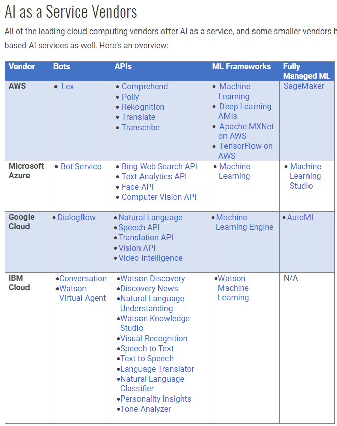
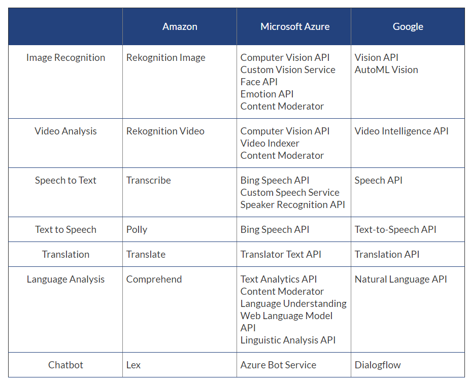

# Rhonda's notes for AI Cloud Overview chapter
## Why AI in the cloud
from Cloud Academy
<https://cloudacademy.com/blog/what-are-the-benefits-of-machine-learning-in
-the-cloud/>

You don’t need to use a cloud provider to build a machine learning solution. After all, there are plenty of open source machine learning frameworks, such as TensorFlow, MXNet, and CNTK that companies can run on their own hardware. However, companies building sophisticated machine learning models in-house are likely to run into issues scaling their workloads, because training real-world models typically requires large compute clusters.

The barriers to entry for bringing machine learning capabilities to enterprise applications are high on many fronts. The specialized skills required to build, train, and deploy machine learning models and the computational and special-purpose hardware requirements add up to higher costs for labor, development, and infrastructure.

These are problems that cloud computing can solve and the leading public cloud platforms are on a mission to make it easier for companies to leverage machine learning capabilities to solve business problems without the full tech burden.

from Forbes
<https://www.forbes.com/sites/janakirammsv/2018/02/22/the-rise-of-artificial-intelligence-as-a-service-in-the-public-cloud/#6fc83136198e>

Apart from offering the APIs and infrastructure, cloud providers are competing to build tools for data scientists and developers. These tools are tightly integrated with the data platform and compute platform, which will indirectly drive the consumption of VMs, containers, storage, and databases.

from Datamation, AI in the Cloud Boosts Cloud Performance, <https://www.datamation.com/cloud-computing/ai-in-the-cloud-boosts-cloud-performance.html>

But while enterprises might be enthusiastic about the potential of AI, they also recognize that successful deployment of the technology poses significant challenges. In that same survey, 91 percent of respondents anticipated barriers to AI adoption. More specifically, 40 percent didn't believe they had the right infrastructure to support AI. 

 Utilizing cloud AI services offers a number of benefits:

1. **Access to Advanced Compute Infrastructure** — Machine learning and neural networks require massive amounts of parallel processing power. To meet that need, AI applications must run on systems with advanced graphic processing units (GPUs). However, those systems can be very expensive — making them somewhat impractical for pilot projects. Using a cloud service allows enterprises to get the compute resources they need for AI initiatives while paying only for what they use. And if a pilot project doesn't pan out, they can easily shut it down without being saddled with expensive hardware they no longer need.

2. **Scalability** — When enterprises experience success with their initial AI efforts, they often want to expand those projects. The cloud makes it easy to scale those projects up or down as demand warrants. And the cloud model makes it easy for companies to broaden the use of the technology to additional departments and business units within the organization.

3. **Ease of Use** — Competition is fierce for developers and data scientists who understand artificial intelligence technology. As a result, salaries are very high for these professionals. Many organizations find that they can't find or can't afford AI talent, and developing AI skills among their existing workforce takes time. However, the major cloud vendors are meeting this need by rolling out AI services that simplify both the process of creating and training machine learning models and the process of adding speech, image recognition or natural language processing to applications. That, in turn, helps companies overcome any lack of internal AI talent.

4. **Access to the Latest Technology** — The Teradata survey respondents rightly pointed out that AI technology is still young and changing every day. Because of their AI research and development investments, the major cloud vendors are rolling out new AI capabilities on a regular basis. If an enterprise were to invest in AI hardware and software for its own data centers, they may find that their technology quickly becomes obsolete. But using the AI cloud services allows organizations to stay at the cutting-edge of advancements.

5. **Low Costs**— This article has already mentioned the financial advantages of cloud-based AI several times, but it bears repeating. The cloud computing model allows organizations to pay only for the computing resources that they are using for their AI application deployments. That eliminates the need for costly upfront capital expenses, allows organizations to convert their infrastructure costs to operational expenses, and often reduces the overall price tag for artificial intelligence projects.

## Types of Cloud AI services and how they are grouped
The list of AI cloud services are growing; as a result the industry starts to
 separate the services into subcategories.  Below are several approaches.
 
from Datamation
<https://www.datamation.com/cloud-computing/artificial-intelligence-as-a
-service-ai-meets-the-cloud.html>

AI as a service offerings make one or more of these types of artificial intelligence technologies available as a cloud service. Currently, the AI as a service products on the market generally fall into the following categories:

* **Bots and digital assistants**:For many people, the first thing that comes to
 mind when they hear the phrase "artificial intelligence" is a digital assistant like Apple's Siri, Microsoft's Cortana or Amazon's Alexa. These tools use natural language processing technology to carry on conversations with users, and many also use machine learning to improve their skills over time. Many enterprises want to add similar functionality to their products and websites. In fact, according to IDC, the AI use case that saw the most spending in 2017 was automated customer service agents. But creating your own bot from scratch is a monumental undertaking. As an alternative, several vendors offer bot platforms as a service. Organizations train the bots with their own data and then use them to answer simple questions, freeing up human customer service agents for more complicated tasks.
* **Cognitive computing APIs**:An application programming interface (API
) makes it easy for developers to incorporate a technology or service into the application or products they are building. The leading cloud vendors all offer an assortment of APIs for that allow developers to add a particular type of AI to their applications. For example, a developer that wants to make a photo-sharing app might use a facial recognition API to give the app the ability to identify individuals in pictures. Thanks to the API, the developer doesn't have to write the facial recognition code from scratch or even thoroughly understand how it works. He or she uses the API to allow the app to access that functionality in the cloud. APIs are available for a wide variety of different purposes, including computer vision, computer speech, natural language processing, search, knowledge mapping, translation and emotion detection.
* **Machine learning frameworks**: These tools allow developers to create
 applications that can improve over time. Generally, they require developers or data scientists to build a model and then train that model using existing data. Machine learning frameworks are particularly popular in applications related to big data analytics, but they can be used to create many other types of applications as well. Accessing these frameworks in the cloud can be easier and less expensive than setting up your own hardware and software for machine learning tasks.
* **Fully managed machine learning services**: Sometimes organizations want to
 add machine learning capabilities to an application, but their developers or data scientists lack some of the skills or experience necessary. Fully managed machine learning services use templates, pre-built models and/or drag-and-drop development tools to simplify and expedite the process of using a machine learning framework.
 
The "holy grail" of AI as a service would be to create a general artificial intelligence that could be accessed as a cloud service. A general artificial intelligence is a computer system that can think and communicate in all the same ways that humans can. Most experts believe that researchers are still many years away from creating general AI, if they will ever be able to do so at all.

from
<https://cloudacademy.com/blog/what-are-the-benefits-of-machine-learning-in
-the-cloud/>

From Datamation: The Top Cloud-Based AI Services <https://www.datamation.com/artificial-intelligence/the-top-cloud-based-ai-services.html>

1. **IBM** Watson:	Largest and most diverse set of AI services; established and mature program in Watson; IBM Global Services is unmatched in consulting.
2. **Amazon** Web Services:	Rapidly maturing set of services based around its popular consumer products; runs on AWS, the top cloud service provider
3. **Microsoft** Azure:	Built on Microsoft legacy software; Microsoft’s strong history supporting developers
4. **Google** Cloud AI:	Top performance thanks to custom chips to accelerate AI and ML; specializing in machine learning.
5. **Oracle** AI:	Built on Oracle’s legacy line of business apps, so you can add AI to your Oracle environment.
6. **Salesforce**:	Easy and rapid development of apps; adds AI to Salesforce’s comprehensive CRM offerings.
7. **Baidu**:	Mirrors Google in terms of features and specialized accelerator chips.

