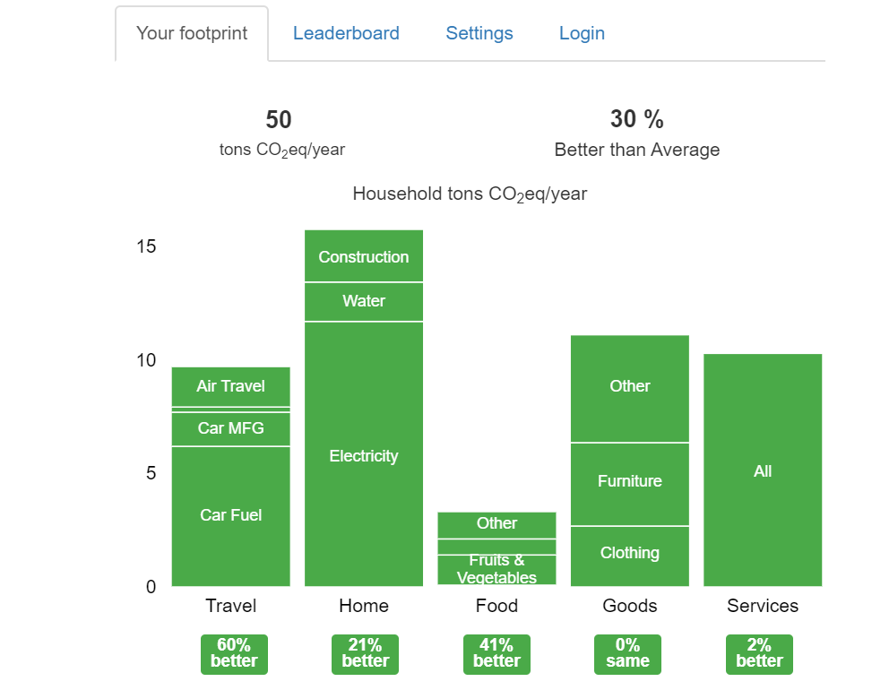

# Data Centers assignment by R.Fischer

## E.DataCenter.1

**Cologix** data center **COL3** in Columbus, Ohio: 

160K sqft, 18MW of computing (112.5 watts/sqft), opened in 2018

from: <https://data-economy.com/cologix-invests-130m-triple-ohio-data-centre-business/>

Columbus, OH Electricity costs (from <https://openei.org/apps/USURDB/?utilRateFinder=City+of+Columbus%2C+Ohio+%28Utility+Company%29&service_type=&is_default=&search=>
)

Commercial: 10.7 cents per kW/hr 

Industrial: 10.2 cents per kW/hr

Also in Columbus, OH,  **Expedient** data center, <https://www.datacenters.com/expedient-columbus-upper-arlington>

20,000 sqft,
1.75Mw, or 87.5 watts/sqft

## E.Datacenter.3

Personal carbon usage 50 tons CO2 eq/year, see image

## E.Datacenter.4

Pick a renewal energy from Section 4.1.10 and describe what it is. Find data centers that use this energy form. Include the information in your hid directory under the file datacenter.md

## E.Datacenter.5:

Pick a country, state, or company from Section 4.1.11 and summarize their efforts towards renewable energy and impacts within the society. Create a section and contribute it to the datacenter.md file. Use internet resources and cite them.
## E.Datacenter.6:

Write about cooling technologies in datacenter rack doors so it can be contributed to Section 4.1.5.5.1.1.
## E.Datacenter.7:

Review: Nature Article. Is there any more up to data available? What lessons do we take away from the article?
## E.Datacenter.8:

Find major data center outages and discuss the concrete impact on the internet and user community. Concrete means here not users of the center xyz lost services, but can you identify how many users or how many services were impacted and which? Is there a cost revenue loss projected somewhere? If you find an outage, do significant research on it. For example, other metrics could include what media impact did this outage have?
